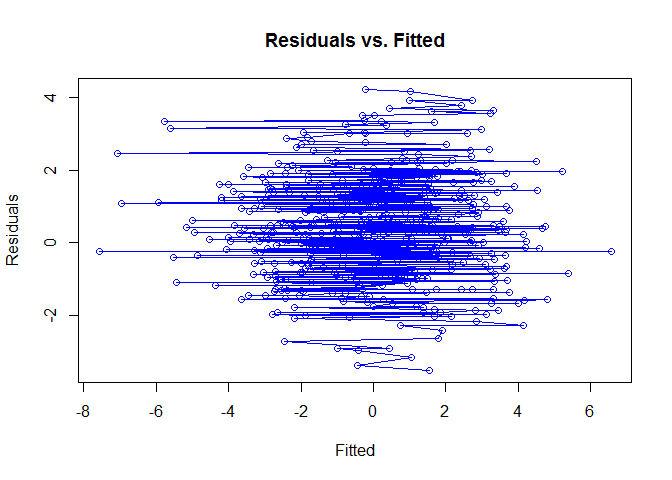

`blm` package description
-------------------------

This package constructs a Bayesian Linear Model, which is a statistical linear regression approach that uses Bayesian inferences. It has a similar structure and appearance as the `lm` and `glm` interfaces. The Bayesian Linear Model takes on the structure y ~ x (+ other predictors) and provides a training set from which to predict response variables from real data.

This package was built as part of the course "Data Science: Software Development and Testing" during 2016-17 at the Bioinformatics Research Centre (BiRC) at Aarhus University, and is still under development using GitHub.

Using the `blm` package
-----------------------

### Installation

As this package is still under development, it can only be accessed and installed through github. In order to install a package through github, it requires the `devtools` package in R. Ensure that it is installed:

``` r
install.packages("devtools")
library(devtools)
```

Then install and load the package using the `install_github` feature:

``` r
install_github("laurenejames/blm")
library(blm)
```

### Features of the `blm` package

There are three built-in functions that aid in the set up for the constructor in the the main function `blm()` which are not so important, but will be listed here for information purposes:

`make_prior()`

This creates a prior distribution, with the following inputs `make_prior(model, alpha, mu = c(0,0))` where the model is a formula in the `blm` format mentioned above.

`model_matrix_responseless()`

Required to give the phiX matrix for the posterior distribution, with the following inputs `model_matrix_responseless(model, ...)` where the `...` indicates an optional data frame addition.

`update()`

Updates the prior distribution using observed data to generate a posterior distribution, with the following inputs `update(model, prior, beta, ...)`

**The main function: the `blm` constructor**

`blm()`

This produces the Bayesian Linear Modelm and the object for the functions mentioned below.

*Functions associated with `blm()`*

-   `coef()` Returns the coefficients of the blm(), mean and Sigma

-   `confint()` Returns a dataframe containing the mean, and confidence intervals (level set by an input to the function). Input parameters are as follows, `confint(object, parm, level, ...)` where the object is the blm, parm is the parameter(s) in question (default considers all parameters) and level sets the confidence interval (default is 95%).

-   `deviance()` Returns the deviance of the blm object when fitting a model and predicting the response variable based on the fitted blm.

-   `fitted()` Returns the fitted response variables from the blm

-   `plot()` Plots the residuals vs. the fitted response variable for the blm object.

-   `predict()` Predicts response variables using a new data set from the fitted blm object. If there is no new data inputed into the function, it predicts based on the fitted response variable.

-   `print()` Prints the following features of the blm object:
-   Fitted blm
-   The fitted model's coefficients

-   `residuals()` Returns the residual values from the predicted response variable

-   `summary()` Returns the following features of the blm object:
-   Fitted blm
-   The fitted model's coefficients
-   The fitted model's residuals
-   The fitted model's deviance

### Example of using the `blm` package

``` r
# Create simulation data
alpha = 2; beta = 0.4
w0 = 0.5; w1 = 0.2; w2 = 1.2
simdata = data.frame(x = rnorm(500), z = rnorm(500))
simdata$y = rnorm(500, w0+w1*simdata$x+w2*simdata$z, 1/beta)
simmodel = y ~ x + z

# Construct the blm
my_new_blm = blm(simmodel, make_prior(simmodel, alpha, mu = c(0,0)), beta, simdata)

# Exploit all the functions
coef(my_new_blm)
```

    ## $mean
    ##                  [,1]
    ## (Intercept) 0.5058101
    ## x           0.3971654
    ## z           1.3389025
    ## 
    ## $Sigma
    ##              (Intercept)             x             z
    ## (Intercept) 5.009016e-03  0.0003248311  6.641326e-05
    ## x           3.248311e-04  0.0051635489 -1.043248e-04
    ## z           6.641326e-05 -0.0001043248  5.073306e-03

``` r
confint(my_new_blm)
```

    ##                  Mean     0.025     0.975
    ## (Intercept) 0.5058101 0.4959926 0.5156276
    ## x           0.3971654 0.3870450 0.4072857
    ## z           1.3389025 1.3289590 1.3488460

``` r
fitted(my_new_blm)
```

    ##     New Prediction    Sigma
    ## 1      1.631888785 2.511472
    ## 2     -1.297714340 2.528885
    ## 3      3.907840449 2.535745
    ## 4     -0.287995265 2.511574
    ## 5     -0.864497147 2.514110
    ## 6      0.397258629 2.505182
    ## 7      0.302569169 2.506657
    ## 8      0.244443566 2.510723
    ## 9      1.474948578 2.509176
    ## 10    -0.565477566 2.507910
    ## 11     3.138376950 2.526057
    ## 12     1.042977608 2.506215
    ## 13     0.430198796 2.520369
    ## 14     3.553777296 2.530202
    ## 15     0.865754426 2.505428
    ## 16    -1.473116688 2.524421
    ## 17     1.910278032 2.515652
    ## 18     0.712618782 2.523677
    ## 19    -1.915096353 2.526219
    ## 20    -2.404309930 2.526171
    ## 21     0.305237858 2.506452
    ## 22    -3.136359721 2.539238
    ## 23     0.483719552 2.507050
    ## 24    -0.822162810 2.513479
    ## 25    -0.002293892 2.507446
    ## 26     0.489777845 2.508504
    ## 27     1.338954596 2.507110
    ## 28     1.672208017 2.509423
    ## 29     1.832823201 2.511176
    ## 30    -1.239923357 2.517765
    ## 31    -1.233227319 2.512473
    ## 32     0.251701202 2.505460
    ## 33     2.628866841 2.519012
    ## 34     0.903791667 2.506049
    ## 35     0.798456304 2.505926
    ## 36     1.453747153 2.520401
    ## 37     0.942039164 2.505705
    ## 38    -0.422324250 2.508244
    ## 39    -0.169421400 2.509139
    ## 40     1.613351411 2.519544
    ## 41    -0.497771504 2.512585
    ## 42     0.644452296 2.505085
    ## 43    -0.976598828 2.510852
    ## 44    -0.209236736 2.506213
    ## 45    -1.269256590 2.513793
    ## 46    -1.182479906 2.517081
    ## 47     3.506209810 2.544523
    ## 48    -0.941867876 2.510824
    ## 49     1.713229953 2.512645
    ## 50     3.363015030 2.529651
    ## 51     0.884160282 2.521245
    ## 52     1.360628147 2.507433
    ## 53     0.121399539 2.518416
    ## 54     1.096644288 2.521553
    ## 55     0.537467222 2.505011
    ## 56    -0.816708315 2.509701
    ## 57    -0.067779246 2.508060
    ## 58     2.999079293 2.521907
    ## 59     0.241229389 2.508077
    ## 60    -1.434230019 2.518632
    ## 61    -1.001526945 2.523071
    ## 62    -2.890838978 2.540099
    ## 63     0.024354784 2.506110
    ## 64    -0.837209047 2.512712
    ## 65     1.688504151 2.514793
    ## 66     0.655720838 2.514429
    ## 67     3.784066298 2.566006
    ## 68    -1.559935257 2.517261
    ## 69     0.464059772 2.505025
    ## 70     1.988794128 2.511836
    ## 71    -0.348891986 2.545363
    ## 72     2.219914937 2.520185
    ## 73     0.082263378 2.505399
    ## 74     3.321112839 2.528864
    ## 75    -0.466073564 2.508325
    ## 76     0.953177414 2.505829
    ## 77    -1.516371366 2.516569
    ## 78    -1.982840544 2.523171
    ## 79    -2.058563805 2.523876
    ## 80    -0.604779030 2.512818
    ## 81     0.945665598 2.507214
    ## 82    -1.441824235 2.517891
    ## 83     2.181203902 2.515336
    ## 84    -0.174772448 2.508509
    ## 85    -0.993115070 2.511647
    ## 86     0.835578361 2.507790
    ## 87     1.262849952 2.518271
    ## 88     0.831671193 2.508376
    ## 89    -0.983219829 2.510502
    ## 90     1.455278227 2.507552
    ## 91     0.111176796 2.511139
    ## 92     1.786333909 2.520357
    ## 93     1.007705717 2.511202
    ## 94     1.991954439 2.532388
    ## 95     0.903218295 2.507695
    ## 96    -0.217154019 2.506295
    ## 97    -0.078684506 2.517309
    ## 98     0.303947608 2.512057
    ## 99     1.591186404 2.508732
    ## 100   -1.065775577 2.511364
    ## 101   -0.367476352 2.510450
    ## 102   -0.105655064 2.506666
    ## 103   -1.090054554 2.511202
    ## 104    0.225117107 2.507308
    ## 105   -0.878207767 2.516803
    ## 106   -1.299750293 2.519052
    ## 107    2.106037850 2.517866
    ## 108   -0.119510239 2.508613
    ## 109    0.987651011 2.515044
    ## 110   -1.093012129 2.511425
    ## 111    0.937360525 2.505574
    ## 112    1.090765555 2.507630
    ## 113    2.872984114 2.521225
    ## 114    2.384679962 2.515022
    ## 115    0.589596731 2.514133
    ## 116    2.457354666 2.528805
    ## 117   -0.755573673 2.508809
    ## 118    0.260689510 2.507355
    ## 119   -0.645802482 2.511895
    ## 120    0.463047735 2.526523
    ## 121    1.509163899 2.507837
    ## 122    1.444437797 2.513858
    ## 123   -0.338905650 2.510303
    ## 124   -0.261145396 2.512293
    ## 125   -0.814317086 2.509595
    ## 126   -0.366954616 2.506950
    ## 127    1.303162371 2.508847
    ## 128   -0.924576483 2.511892
    ## 129   -0.050055203 2.505842
    ## 130    1.013917812 2.549450
    ## 131    0.834577225 2.511747
    ## 132   -0.402764824 2.507045
    ## 133   -1.068470255 2.511909
    ## 134    0.554577593 2.507276
    ## 135    1.061179707 2.506871
    ## 136   -0.752262305 2.509674
    ## 137    0.402659510 2.507333
    ## 138    0.042021023 2.507450
    ## 139    3.304500201 2.527485
    ## 140    4.160240671 2.541216
    ## 141   -0.249016339 2.514099
    ## 142    1.656324066 2.508734
    ## 143   -2.693407060 2.538294
    ## 144    1.687323030 2.508858
    ## 145    2.210423705 2.513332
    ## 146    1.671829038 2.511102
    ## 147   -1.551335638 2.520251
    ## 148    1.611165723 2.509932
    ## 149   -0.899106960 2.511524
    ## 150    0.072601823 2.505728
    ## 151    0.088732681 2.516925
    ## 152    1.277782845 2.507251
    ## 153    0.512649303 2.506472
    ## 154    2.414926688 2.522107
    ## 155   -0.321337392 2.507207
    ## 156    3.701835373 2.545085
    ## 157   -0.242481701 2.507182
    ## 158   -0.723466879 2.508984
    ## 159    2.214187494 2.513366
    ## 160    2.690907041 2.518969
    ## 161   -2.621432459 2.533733
    ## 162    0.866339962 2.506418
    ## 163   -1.347830139 2.514169
    ## 164   -0.028452946 2.513047
    ## 165   -0.938337556 2.510624
    ## 166   -1.575030882 2.516078
    ## 167    2.028024440 2.512007
    ## 168    2.238145961 2.513248
    ## 169    0.375406962 2.505770
    ## 170   -3.364834849 2.548773
    ## 171   -0.411419417 2.518590
    ## 172    0.724095917 2.505261
    ## 173    0.132945322 2.505788
    ## 174   -0.609517849 2.508120
    ## 175    1.157661796 2.525338
    ## 176    3.111248391 2.523154
    ## 177    0.720126907 2.512626
    ## 178   -1.969826934 2.526907
    ## 179    0.551354644 2.505772
    ## 180    0.298086349 2.508994
    ## 181    2.756691813 2.518704
    ## 182    1.385496907 2.530322
    ## 183    0.005598259 2.505539
    ## 184   -1.739707721 2.517536
    ## 185    1.703693468 2.511000
    ## 186   -0.502276684 2.516147
    ## 187    0.041786963 2.510678
    ## 188   -0.346454530 2.507088
    ## 189   -0.178781773 2.530344
    ## 190   -0.703139761 2.517864
    ## 191    0.552236437 2.534039
    ## 192    0.141145657 2.507784
    ## 193    0.314938674 2.505352
    ## 194   -1.820057949 2.520183
    ## 195    2.496517402 2.520424
    ## 196    2.047024829 2.511554
    ## 197    0.120952636 2.505413
    ## 198   -0.880789574 2.510360
    ## 199    1.918469635 2.511542
    ## 200   -0.718809866 2.509953
    ## 201   -1.629996965 2.519233
    ## 202    1.599246306 2.511994
    ## 203    2.992343637 2.521651
    ## 204    1.292208510 2.506870
    ## 205   -0.513964624 2.508060
    ## 206    1.458099633 2.509332
    ## 207    1.061171342 2.507304
    ## 208    0.286880924 2.516420
    ## 209   -0.173117938 2.506038
    ## 210   -0.721543581 2.508594
    ## 211   -1.375702056 2.521465
    ## 212    0.475026325 2.508887
    ## 213   -0.171407638 2.507791
    ## 214    0.047954155 2.522364
    ## 215   -1.000335131 2.519601
    ## 216    0.543441370 2.528137
    ## 217   -1.844110475 2.520016
    ## 218   -2.163800612 2.524598
    ## 219    1.571795312 2.521477
    ## 220    0.471591740 2.507639
    ## 221    0.487617222 2.505291
    ## 222    1.104692544 2.509497
    ## 223    1.867549155 2.511528
    ## 224    1.298582248 2.506941
    ## 225   -0.001742324 2.520231
    ## 226   -1.356637048 2.520217
    ## 227    1.895315875 2.515029
    ## 228    0.044598879 2.512050
    ## 229   -1.918115432 2.523033
    ## 230   -1.289396453 2.517813
    ## 231   -0.187569756 2.508602
    ## 232    1.951192524 2.510983
    ## 233    0.531215817 2.505677
    ## 234    3.328044254 2.527972
    ## 235    1.672029047 2.509132
    ## 236    3.253968410 2.529589
    ## 237   -0.170911581 2.519749
    ## 238    1.676704041 2.509095
    ## 239    1.924241828 2.512155
    ## 240    1.161233995 2.517409
    ## 241   -0.603569908 2.518752
    ## 242   -1.402126894 2.516770
    ## 243    1.711712856 2.511824
    ## 244    0.221662730 2.508360
    ## 245    1.086706145 2.510151
    ## 246   -0.027287741 2.519512
    ## 247    0.440013085 2.515048
    ## 248    1.307723074 2.512343
    ## 249   -0.625416793 2.509718
    ## 250    1.077741688 2.507919
    ## 251    2.010699007 2.512001
    ## 252    0.651925088 2.507288
    ## 253    0.554653855 2.505218
    ## 254    1.617466845 2.508990
    ## 255   -0.056725277 2.512473
    ## 256   -1.279971148 2.512923
    ## 257    1.084150781 2.506024
    ## 258    0.364374428 2.507640
    ## 259    2.115935030 2.515335
    ## 260   -0.098379745 2.507379
    ## 261    1.983357857 2.513609
    ## 262    1.384298917 2.511069
    ## 263   -1.527793885 2.515188
    ## 264    1.493231209 2.512761
    ## 265    1.792687315 2.513508
    ## 266    0.510990934 2.505193
    ## 267    1.263442661 2.507006
    ## 268    0.874580153 2.505430
    ## 269    3.898282893 2.537402
    ## 270   -0.564333925 2.507701
    ## 271    0.339777354 2.506370
    ## 272    3.031000232 2.522839
    ## 273   -1.339716730 2.514623
    ## 274    0.217741807 2.520454
    ## 275   -1.466132047 2.518398
    ## 276    1.912751506 2.512792
    ## 277    2.524459810 2.517663
    ## 278    0.662451786 2.505295
    ## 279    1.948382035 2.511201
    ## 280    1.559882969 2.510907
    ## 281   -1.768153831 2.518357
    ## 282   -0.884244708 2.512525
    ## 283   -1.268727033 2.520174
    ## 284   -0.853437057 2.510757
    ## 285   -0.806224331 2.516073
    ## 286    2.315168911 2.514642
    ## 287    0.384653959 2.511184
    ## 288    1.033655253 2.506254
    ## 289    1.200552253 2.507410
    ## 290   -0.439344583 2.517362
    ## 291   -1.013789223 2.518342
    ## 292    0.461109042 2.531989
    ## 293   -0.667166262 2.508481
    ## 294    0.491733988 2.506865
    ## 295    2.556934448 2.516362
    ## 296    0.387249931 2.505237
    ## 297    0.689844130 2.511317
    ## 298    0.591349265 2.505248
    ## 299   -1.952777895 2.529542
    ## 300    0.833951558 2.532571
    ## 301    1.470202091 2.509600
    ## 302    1.078943835 2.507319
    ## 303    1.251524817 2.506614
    ## 304    1.041567065 2.507539
    ## 305   -0.118731790 2.509652
    ## 306    1.614015306 2.517756
    ## 307    1.447901861 2.509959
    ## 308    0.360667318 2.505014
    ## 309    2.787744676 2.520353
    ## 310    0.091741168 2.532197
    ## 311   -1.654353520 2.516831
    ## 312    0.177462357 2.505984
    ## 313    2.541368334 2.517391
    ## 314    2.263322326 2.517510
    ## 315   -0.204366401 2.506476
    ## 316    1.908508952 2.521051
    ## 317    3.595954569 2.534154
    ## 318   -0.142336919 2.510704
    ## 319   -1.547854435 2.518312
    ## 320   -0.399662434 2.508109
    ## 321    0.423843046 2.508731
    ## 322    1.866916219 2.524300
    ## 323   -1.067655324 2.512144
    ## 324    0.290548471 2.505542
    ## 325   -0.016072315 2.508689
    ## 326    0.735690903 2.505576
    ## 327   -1.739702279 2.518104
    ## 328   -1.373467313 2.515307
    ## 329    0.005334280 2.515050
    ## 330   -3.512701939 2.546566
    ## 331    0.631509966 2.505166
    ## 332    1.603232548 2.511791
    ## 333    1.291198741 2.509921
    ## 334   -1.780466106 2.527217
    ## 335    0.465478403 2.506090
    ## 336    0.507246376 2.506789
    ## 337   -0.271140049 2.574484
    ## 338    0.260976593 2.505250
    ## 339    2.996546682 2.523802
    ## 340   -1.677203343 2.517016
    ## 341    1.004538113 2.509531
    ## 342    0.274972395 2.506327
    ## 343    0.277622802 2.511013
    ## 344    0.468120090 2.505001
    ## 345   -0.902995485 2.517470
    ## 346   -0.547684066 2.512696
    ## 347    1.717313856 2.552482
    ## 348    1.190344201 2.509881
    ## 349   -0.135877068 2.509260
    ## 350   -1.452486434 2.518031
    ## 351    1.307492002 2.508823
    ## 352    0.299145170 2.510038
    ## 353    0.344988492 2.506353
    ## 354    1.950078086 2.511215
    ## 355    2.270939244 2.514576
    ## 356    1.256386276 2.510875
    ## 357    2.043829649 2.553426
    ## 358    1.162566225 2.510875
    ## 359    0.113208113 2.505352
    ## 360    1.500838828 2.514838
    ## 361    0.878703765 2.505493
    ## 362   -2.960460367 2.546184
    ## 363    1.202986764 2.508113
    ## 364    1.878953178 2.515031
    ## 365   -0.859789182 2.509491
    ## 366    1.201208735 2.510063
    ## 367    0.155737084 2.511565
    ## 368    0.395857466 2.506718
    ## 369    0.914934055 2.505610
    ## 370   -0.368219510 2.584005
    ## 371    2.258524989 2.514282
    ## 372    3.634223677 2.536791
    ## 373    0.376773935 2.522023
    ## 374    0.944168389 2.508187
    ## 375    0.563479913 2.505162
    ## 376    0.470806442 2.505647
    ## 377    1.356036097 2.507070
    ## 378   -0.557520402 2.507664
    ## 379    1.493665095 2.518113
    ## 380    1.620633600 2.512784
    ## 381    0.619841356 2.505052
    ## 382   -0.735876741 2.508896
    ## 383    1.285409272 2.508093
    ## 384   -0.792220470 2.514348
    ## 385    0.274595885 2.509053
    ## 386   -0.160505624 2.514150
    ## 387    0.452135262 2.508228
    ## 388    0.921580426 2.507765
    ## 389    0.014174592 2.506688
    ## 390    0.825195131 2.512605
    ## 391   -1.159168214 2.519911
    ## 392    1.297343346 2.508007
    ## 393   -1.273509033 2.514078
    ## 394    1.153218466 2.516263
    ## 395    0.765003273 2.520745
    ## 396    2.689406730 2.517773
    ## 397    1.187059460 2.514092
    ## 398   -1.312411110 2.514745
    ## 399    0.427267718 2.505759
    ## 400    0.774839045 2.519254
    ## 401    1.372898710 2.509119
    ## 402    2.521221449 2.519523
    ## 403    0.278308296 2.506106
    ## 404    0.486699457 2.505340
    ## 405    0.416900977 2.522278
    ## 406   -0.295380124 2.514928
    ## 407    1.722653893 2.512750
    ## 408    1.205300144 2.506541
    ## 409   -1.124929402 2.511512
    ## 410   -0.042503422 2.520442
    ## 411    1.957737562 2.510761
    ## 412    0.244426100 2.505147
    ## 413    1.840800457 2.510036
    ## 414   -1.911229348 2.551846
    ## 415    0.393925200 2.505183
    ## 416    0.509163021 2.505092
    ## 417   -0.132894477 2.512211
    ## 418    0.758640147 2.505669
    ## 419    1.496618563 2.508647
    ## 420    0.643736361 2.511013
    ## 421    0.220100145 2.508012
    ## 422    1.792218759 2.510050
    ## 423   -0.458361190 2.508415
    ## 424    0.159269379 2.510475
    ## 425   -2.908984403 2.566523
    ## 426   -1.026998226 2.511203
    ## 427    1.159821064 2.508489
    ## 428    1.139306143 2.524618
    ## 429    2.881567563 2.535031
    ## 430    1.375308803 2.509300
    ## 431    0.887360255 2.505498
    ## 432    0.828121157 2.505537
    ## 433   -1.854275478 2.543684
    ## 434   -0.007702185 2.512065
    ## 435    0.442349232 2.505007
    ## 436   -0.099255023 2.506001
    ## 437    0.042801268 2.509739
    ## 438    0.722659316 2.505190
    ## 439    1.481695886 2.507968
    ## 440    2.269986812 2.513426
    ## 441   -0.183236078 2.513306
    ## 442    1.935458744 2.510714
    ## 443    0.727574149 2.513815
    ## 444    1.714323164 2.509872
    ## 445    0.283333525 2.510814
    ## 446   -2.023760881 2.520935
    ## 447   -0.106344589 2.559305
    ## 448    0.096421373 2.506179
    ## 449   -2.276239443 2.525420
    ## 450    0.705145141 2.506048
    ## 451   -1.527585876 2.518223
    ## 452    0.126699950 2.508437
    ## 453   -0.243510510 2.508282
    ## 454   -0.726314141 2.516491
    ## 455   -2.254521048 2.524494
    ## 456   -0.504432534 2.509862
    ## 457    1.205170070 2.507037
    ## 458    1.445980225 2.507826
    ## 459    1.893180852 2.510273
    ## 460   -0.689081022 2.509348
    ## 461   -1.669851565 2.516946
    ## 462    3.228273136 2.525438
    ## 463   -1.276530057 2.516041
    ## 464   -1.607441683 2.553797
    ## 465    3.026996194 2.551949
    ## 466    0.891607123 2.519206
    ## 467    0.686145180 2.508743
    ## 468    0.042705197 2.527390
    ## 469    2.192705692 2.514164
    ## 470   -0.772661025 2.511267
    ## 471    0.613697270 2.506340
    ## 472    1.232719388 2.511804
    ## 473   -0.119817880 2.505865
    ## 474   -0.950494966 2.517060
    ## 475    4.199736103 2.541964
    ## 476    0.057400478 2.523652
    ## 477   -1.280652241 2.529050
    ## 478   -0.848614418 2.509878
    ## 479    1.972246467 2.514039
    ## 480    0.881132054 2.505512
    ## 481    2.075387335 2.513612
    ## 482   -2.064450032 2.530238
    ## 483   -2.029114480 2.524509
    ## 484   -0.068423377 2.506202
    ## 485    2.060449074 2.513261
    ## 486   -0.528837752 2.510622
    ## 487    1.419796293 2.519760
    ## 488    0.159891144 2.505322
    ## 489    0.136376181 2.506489
    ## 490    1.588283192 2.528752
    ## 491    1.955490770 2.512761
    ## 492    3.004508857 2.526830
    ## 493    3.488345255 2.531147
    ## 494    1.241189188 2.514994
    ## 495    1.815957760 2.513615
    ## 496   -1.179466333 2.516509
    ## 497   -0.214983090 2.509285
    ## 498    0.927786426 2.507466
    ## 499   -0.586042001 2.510183
    ## 500    1.887913051 2.513366

``` r
## Second data set for the predict function
simdata2 = data.frame(x = rnorm(500), z = rnorm(500))
simdata2$y = rnorm(500, w0+w1*simdata2$x+w2*simdata2$z, 1/beta)

# Carry on exploiting the functions
predict(my_new_blm, simdata2, beta)
```

    ##     New Prediction    Sigma
    ## 1      1.675392678 2.512313
    ## 2      1.616568045 2.522040
    ## 3      2.474291724 2.539844
    ## 4      1.439080723 2.522086
    ## 5      0.024111079 2.508277
    ## 6     -2.339495394 2.536479
    ## 7      0.539194623 2.507717
    ## 8     -0.617002625 2.517051
    ## 9      0.409813324 2.505581
    ## 10     1.343076550 2.514117
    ## 11     0.251065247 2.515804
    ## 12     0.894171999 2.520297
    ## 13     1.094759561 2.507006
    ## 14     2.083580971 2.518657
    ## 15     1.561044574 2.516873
    ## 16     1.228112815 2.507892
    ## 17    -0.167370247 2.510242
    ## 18     1.849668334 2.514020
    ## 19     0.983818255 2.506460
    ## 20     1.090581519 2.513751
    ## 21    -0.536774186 2.522866
    ## 22    -0.955711947 2.515031
    ## 23     3.103986449 2.545674
    ## 24     1.833881792 2.513615
    ## 25     1.638895202 2.517122
    ## 26     2.511750485 2.528273
    ## 27     0.922217087 2.509428
    ## 28     0.089000228 2.505407
    ## 29     0.754039137 2.544534
    ## 30     0.414682952 2.512143
    ## 31     1.558710329 2.510931
    ## 32    -1.076995192 2.527041
    ## 33     0.502734418 2.507915
    ## 34     2.496621351 2.523141
    ## 35     1.221506306 2.508196
    ## 36    -0.704043184 2.511461
    ## 37     1.446530482 2.509566
    ## 38     0.505493410 2.512569
    ## 39     0.376660105 2.505266
    ## 40     0.043975974 2.506394
    ## 41    -0.478979542 2.545460
    ## 42     2.732343112 2.527574
    ## 43     1.812709932 2.517281
    ## 44     0.698041839 2.516450
    ## 45     0.122068619 2.508108
    ## 46     0.428347485 2.505050
    ## 47    -2.556691852 2.541357
    ## 48     0.278526273 2.509422
    ## 49    -0.545317301 2.509035
    ## 50    -0.472068108 2.510353
    ## 51     1.094927073 2.508240
    ## 52     1.467665527 2.510844
    ## 53     0.001209085 2.510028
    ## 54     3.004111059 2.534114
    ## 55    -0.064026085 2.505955
    ## 56     0.191612429 2.505404
    ## 57    -1.192646648 2.521550
    ## 58     0.054966617 2.508111
    ## 59    -1.799834084 2.525136
    ## 60    -0.982464882 2.514836
    ## 61    -0.654093489 2.509614
    ## 62     0.441534294 2.514947
    ## 63     0.961011751 2.506448
    ## 64    -0.630734417 2.512859
    ## 65     0.624916079 2.507422
    ## 66    -0.533072868 2.512910
    ## 67     1.554715055 2.512886
    ## 68     1.758170958 2.514280
    ## 69    -1.622841094 2.523448
    ## 70    -0.596489536 2.522677
    ## 71     1.258616107 2.511807
    ## 72     1.623396696 2.512091
    ## 73     0.241604360 2.505533
    ## 74     1.502679840 2.512876
    ## 75    -1.192356738 2.516682
    ## 76    -1.140802518 2.523876
    ## 77    -0.767133287 2.512893
    ## 78    -1.277276449 2.518677
    ## 79     0.050684027 2.505917
    ## 80    -0.807285393 2.514424
    ## 81     1.140062382 2.508467
    ## 82     2.059899050 2.519933
    ## 83    -0.577912656 2.513009
    ## 84     0.037741242 2.506572
    ## 85    -0.918357521 2.512588
    ## 86     1.342824445 2.508696
    ## 87    -1.583005088 2.522105
    ## 88     0.252544909 2.505126
    ## 89    -1.537596058 2.521976
    ## 90     1.699538415 2.514678
    ## 91     0.149489875 2.510218
    ## 92    -1.010334250 2.549242
    ## 93     0.078825982 2.511758
    ## 94    -0.138711209 2.506714
    ## 95     2.056335777 2.516439
    ## 96     1.471275051 2.509728
    ## 97    -0.047945866 2.511284
    ## 98    -0.408308899 2.507957
    ## 99    -1.396763024 2.520288
    ## 100    1.965199190 2.522674
    ## 101   -0.402685697 2.516705
    ## 102    1.931794676 2.515174
    ## 103    0.706712075 2.507035
    ## 104   -0.591991088 2.512247
    ## 105    1.019365648 2.506615
    ## 106    0.628808391 2.509331
    ## 107    1.355628108 2.509028
    ## 108   -1.217720446 2.523365
    ## 109    1.940022121 2.515010
    ## 110    0.065403286 2.505479
    ## 111    1.741148455 2.512703
    ## 112    0.616721261 2.506349
    ## 113    1.782685945 2.523933
    ## 114    0.509764280 2.505525
    ## 115    1.760425280 2.513645
    ## 116    1.197494073 2.507615
    ## 117   -0.044639540 2.506739
    ## 118    2.545518597 2.524235
    ## 119    0.391878728 2.523347
    ## 120   -1.640794830 2.523886
    ## 121    0.535098915 2.512334
    ## 122    0.471045268 2.509161
    ## 123    1.277299994 2.511160
    ## 124    0.994104838 2.506517
    ## 125   -1.390378883 2.522486
    ## 126    1.335594249 2.510220
    ## 127    0.480728329 2.507070
    ## 128    1.505689641 2.516730
    ## 129    0.025447490 2.507472
    ## 130   -0.130172976 2.523439
    ## 131    1.777081841 2.513907
    ## 132    0.926382648 2.508655
    ## 133   -1.242427967 2.529355
    ## 134    1.168715483 2.522326
    ## 135   -1.127555028 2.515116
    ## 136   -0.379038426 2.507679
    ## 137    0.209097675 2.507995
    ## 138    1.328823325 2.509349
    ## 139    0.503872807 2.518884
    ## 140   -0.171000490 2.517472
    ## 141    1.077419345 2.508394
    ## 142    2.315537690 2.524334
    ## 143    0.214407346 2.505170
    ## 144   -0.140956096 2.507088
    ## 145    0.081698448 2.514184
    ## 146    0.413861080 2.513752
    ## 147   -0.135738080 2.530274
    ## 148   -0.106580912 2.508013
    ## 149    0.853552940 2.510022
    ## 150    1.089522505 2.522710
    ## 151    1.802455177 2.513271
    ## 152    0.808291950 2.505696
    ## 153   -0.014531673 2.516487
    ## 154    0.827505260 2.518542
    ## 155   -0.463418816 2.508167
    ## 156   -0.737247925 2.516685
    ## 157    0.857658625 2.510337
    ## 158    1.367003915 2.519133
    ## 159   -0.578634151 2.509130
    ## 160    1.068711653 2.508466
    ## 161    1.711630072 2.512712
    ## 162    2.802962437 2.528860
    ## 163   -0.001951934 2.506063
    ## 164    0.957426963 2.508802
    ## 165    1.432553302 2.527839
    ## 166    0.172682977 2.505219
    ## 167    1.711021038 2.516858
    ## 168    1.053210081 2.507105
    ## 169    0.440255664 2.508736
    ## 170   -0.528937367 2.518172
    ## 171    2.391620342 2.539338
    ## 172   -0.185104398 2.524779
    ## 173    1.972135404 2.521795
    ## 174   -2.551675443 2.541093
    ## 175    0.092951389 2.507598
    ## 176    0.811971895 2.513994
    ## 177    2.230480254 2.522076
    ## 178    0.390198010 2.505033
    ## 179   -0.659824686 2.513100
    ## 180    1.156903124 2.509930
    ## 181    0.812170699 2.509831
    ## 182   -0.884023804 2.518211
    ## 183    1.182913522 2.508034
    ## 184    1.418934086 2.513892
    ## 185   -1.030019116 2.541581
    ## 186   -0.591526062 2.512478
    ## 187   -0.521080754 2.515897
    ## 188    0.561291617 2.508043
    ## 189    0.889987195 2.506256
    ## 190    0.545562901 2.524917
    ## 191    0.796750547 2.509042
    ## 192   -0.195340628 2.506906
    ## 193    0.204454650 2.505559
    ## 194    0.454835503 2.508169
    ## 195    0.543680924 2.505724
    ## 196   -0.414620312 2.508062
    ## 197   -0.581323266 2.509002
    ## 198    0.175637727 2.519544
    ## 199   -0.679043182 2.510033
    ## 200    1.149245837 2.507415
    ## 201   -0.541393251 2.511606
    ## 202   -0.582240914 2.509915
    ## 203    0.396211067 2.509589
    ## 204   -1.180833338 2.517571
    ## 205   -1.083445973 2.514128
    ## 206    1.037008491 2.513326
    ## 207   -0.328123100 2.511797
    ## 208    1.556743078 2.518394
    ## 209    1.284628527 2.513639
    ## 210   -1.398802028 2.521638
    ## 211   -0.223195659 2.509127
    ## 212   -0.902722101 2.513030
    ## 213    1.342332546 2.508926
    ## 214    0.246014138 2.505572
    ## 215    0.837846954 2.511976
    ## 216    2.957429075 2.532738
    ## 217    0.437522287 2.505008
    ## 218    1.428097625 2.512906
    ## 219    1.153580061 2.507341
    ## 220   -0.534516178 2.522129
    ## 221    0.112871011 2.505570
    ## 222    0.085013127 2.506048
    ## 223    0.061609909 2.505484
    ## 224    1.465910740 2.509839
    ## 225    0.140439428 2.510438
    ## 226    0.478659560 2.505544
    ## 227    1.566176489 2.514726
    ## 228    0.676592849 2.505341
    ## 229    1.729460911 2.516051
    ## 230    0.470864082 2.505021
    ## 231    0.695036944 2.510917
    ## 232   -1.730214796 2.525735
    ## 233    1.141474352 2.507263
    ## 234    0.015109745 2.512320
    ## 235    0.722864655 2.505858
    ## 236   -2.390318626 2.537360
    ## 237   -0.310131028 2.512855
    ## 238   -0.315030314 2.511048
    ## 239    1.877991453 2.521830
    ## 240   -0.851722109 2.511511
    ## 241    0.477436262 2.505302
    ## 242    1.418906790 2.509922
    ## 243   -0.341268981 2.520290
    ## 244   -0.940300088 2.534118
    ## 245    0.087536635 2.507965
    ## 246    0.419606880 2.507836
    ## 247   -1.839407792 2.526420
    ## 248   -2.063329044 2.532231
    ## 249    1.690632543 2.516081
    ## 250   -1.029717043 2.530970
    ## 251   -0.497239484 2.510121
    ## 252    1.125636846 2.507545
    ## 253    0.799680973 2.512389
    ## 254    0.248564590 2.528014
    ## 255   -0.213263337 2.509255
    ## 256   -0.864847814 2.535767
    ## 257    1.607314886 2.552498
    ## 258   -1.603415748 2.521976
    ## 259    0.889512919 2.506345
    ## 260   -0.814374887 2.513668
    ## 261   -0.187636934 2.506886
    ## 262    1.169473018 2.511821
    ## 263   -0.609650706 2.531287
    ## 264   -0.250735677 2.511751
    ## 265    2.123070717 2.534506
    ## 266   -0.577200881 2.509031
    ## 267   -1.022667782 2.515574
    ## 268   -1.573366601 2.521160
    ## 269   -0.035497376 2.505920
    ## 270   -0.039719911 2.505830
    ## 271    0.689796746 2.517107
    ## 272   -1.544816587 2.521844
    ## 273   -0.263443746 2.507062
    ## 274   -0.447405984 2.517781
    ## 275   -0.360103061 2.507583
    ## 276    2.661065448 2.532956
    ## 277   -0.318435153 2.507211
    ## 278    1.158635288 2.508500
    ## 279    0.672294424 2.505463
    ## 280    2.469913892 2.530591
    ## 281    0.316596508 2.506026
    ## 282   -1.013158501 2.513841
    ## 283    2.207532858 2.518480
    ## 284    0.058921630 2.505487
    ## 285    0.270575722 2.507259
    ## 286   -0.347364928 2.509034
    ## 287    0.093402079 2.505473
    ## 288    3.442595852 2.543335
    ## 289   -1.432747377 2.519541
    ## 290    0.928501949 2.506949
    ## 291    0.198081805 2.506713
    ## 292   -0.075426187 2.508377
    ## 293    0.021903375 2.509902
    ## 294    1.904991348 2.514941
    ## 295    1.028856370 2.509815
    ## 296   -0.273419943 2.509878
    ## 297   -1.355504612 2.520042
    ## 298    0.781118645 2.512195
    ## 299    0.008325043 2.505819
    ## 300    0.484433005 2.505159
    ## 301   -0.514572692 2.510327
    ## 302    1.109288453 2.519759
    ## 303    1.821467592 2.536724
    ## 304    1.358734043 2.509653
    ## 305    0.011672642 2.505962
    ## 306    0.464787739 2.512140
    ## 307    0.651346990 2.505445
    ## 308   -0.011222593 2.512980
    ## 309    2.182920267 2.524179
    ## 310    2.745497801 2.529646
    ## 311    0.365476538 2.505714
    ## 312    1.785310108 2.531812
    ## 313    1.238640012 2.509038
    ## 314    0.479509732 2.505479
    ## 315    0.454152450 2.508163
    ## 316    1.499281411 2.532927
    ## 317   -0.139798667 2.508557
    ## 318    0.009797926 2.511083
    ## 319    0.849966626 2.506001
    ## 320    1.044326826 2.509000
    ## 321    1.039564793 2.509347
    ## 322    0.838736263 2.521792
    ## 323    0.027877326 2.507224
    ## 324    1.849198707 2.517491
    ## 325    2.554998486 2.524191
    ## 326   -0.022218765 2.507873
    ## 327    0.632822477 2.505817
    ## 328    0.146446562 2.518877
    ## 329   -1.356185911 2.517795
    ## 330    1.271319915 2.508146
    ## 331    0.875885988 2.508512
    ## 332    0.962848145 2.507548
    ## 333    0.294312244 2.505067
    ## 334   -1.039792798 2.518934
    ## 335    0.232592596 2.505124
    ## 336    0.639038294 2.505243
    ## 337   -1.636296293 2.590707
    ## 338    0.653960596 2.505569
    ## 339    1.913521316 2.552381
    ## 340   -0.587494551 2.519021
    ## 341    0.996872024 2.510835
    ## 342    1.742167418 2.530562
    ## 343    1.229622188 2.507835
    ## 344    1.150927432 2.514525
    ## 345   -0.437764346 2.507992
    ## 346   -1.054386287 2.513936
    ## 347   -1.604292224 2.526178
    ## 348    3.021487015 2.542998
    ## 349    0.432178447 2.506924
    ## 350    0.965497994 2.529914
    ## 351    1.389775013 2.513621
    ## 352    1.201612834 2.508343
    ## 353   -0.469296662 2.509407
    ## 354    1.265022371 2.510040
    ## 355   -0.527227632 2.511747
    ## 356    1.412819441 2.509448
    ## 357   -2.130931147 2.533181
    ## 358   -0.434968169 2.533647
    ## 359   -1.683534544 2.523005
    ## 360    1.112065280 2.511235
    ## 361    0.683853940 2.511024
    ## 362    0.250266636 2.511864
    ## 363    0.228400370 2.508839
    ## 364   -1.069375931 2.520064
    ## 365   -1.135620229 2.514874
    ## 366   -2.187419749 2.533395
    ## 367   -1.463967046 2.553806
    ## 368    2.064399156 2.516569
    ## 369    0.350850551 2.507796
    ## 370    0.313005180 2.505038
    ## 371    0.941845292 2.511013
    ## 372    1.813812148 2.513424
    ## 373    1.271552427 2.520324
    ## 374   -2.072454141 2.541555
    ## 375   -0.714988320 2.510622
    ## 376    0.167938842 2.507924
    ## 377    0.549517701 2.508677
    ## 378    0.758648823 2.508619
    ## 379   -0.020086420 2.508393
    ## 380   -2.542846656 2.542785
    ## 381    2.732909502 2.537456
    ## 382   -1.669439479 2.526046
    ## 383   -0.262546544 2.513488
    ## 384    0.755127383 2.509156
    ## 385    1.037566018 2.507452
    ## 386    1.493632744 2.510297
    ## 387    0.700394231 2.506065
    ## 388    0.850755562 2.514020
    ## 389   -1.126157975 2.514934
    ## 390    0.440981470 2.513241
    ## 391    1.157175063 2.509611
    ## 392   -1.088505667 2.540893
    ## 393    0.510559486 2.505506
    ## 394    1.505711581 2.513908
    ## 395   -0.560919158 2.510875
    ## 396   -0.077761482 2.516170
    ## 397    1.280490898 2.508237
    ## 398   -1.216895237 2.515860
    ## 399    0.765771601 2.522266
    ## 400    0.088142126 2.513338
    ## 401    0.781945504 2.505950
    ## 402    1.256321893 2.526254
    ## 403    1.434514627 2.510127
    ## 404    2.847585125 2.545329
    ## 405    1.628620168 2.513726
    ## 406    2.299464390 2.529616
    ## 407   -0.490206548 2.519598
    ## 408    1.655138500 2.511641
    ## 409   -0.469591176 2.508330
    ## 410    0.901090481 2.507900
    ## 411    0.639678551 2.510245
    ## 412    1.601902377 2.513119
    ## 413   -0.372118496 2.507493
    ## 414   -0.675275007 2.539048
    ## 415    0.486398709 2.507465
    ## 416    0.101578054 2.518432
    ## 417   -0.072820445 2.506364
    ## 418    1.844945034 2.514041
    ## 419    1.582455118 2.511274
    ## 420   -0.085757057 2.525174
    ## 421    1.202546745 2.522504
    ## 422   -0.709431498 2.520205
    ## 423    0.299836221 2.505087
    ## 424    1.162980533 2.507434
    ## 425   -0.304367675 2.516817
    ## 426   -0.789928865 2.528070
    ## 427    0.501842840 2.519560
    ## 428    0.814388099 2.506525
    ## 429   -0.423001631 2.509880
    ## 430   -0.804188414 2.512737
    ## 431    1.262585388 2.510024
    ## 432    1.179940623 2.507586
    ## 433   -2.551707404 2.542495
    ## 434    0.585332690 2.515377
    ## 435    0.878122618 2.507528
    ## 436    1.143434828 2.516945
    ## 437    0.844317677 2.526200
    ## 438    1.777208434 2.521578
    ## 439    0.765856066 2.509423
    ## 440    1.040574579 2.506686
    ## 441   -0.080350757 2.508466
    ## 442    0.223252104 2.505137
    ## 443    0.228491619 2.505151
    ## 444   -0.356544357 2.508471
    ## 445   -0.122275185 2.508490
    ## 446   -1.197200286 2.516881
    ## 447   -0.396303702 2.522044
    ## 448   -0.851250064 2.512759
    ## 449    0.877423380 2.508261
    ## 450    0.419294932 2.508702
    ## 451   -0.168787325 2.506995
    ## 452   -0.246699616 2.508953
    ## 453    1.427442710 2.526577
    ## 454    0.726344229 2.512625
    ## 455   -0.759205864 2.510664
    ## 456    1.520184912 2.514564
    ## 457   -0.709081570 2.515473
    ## 458   -0.914492503 2.514624
    ## 459    2.295249618 2.529829
    ## 460   -0.193284362 2.512356
    ## 461    1.732811753 2.523534
    ## 462    1.055558729 2.520709
    ## 463    0.140730040 2.505322
    ## 464    0.851481709 2.506385
    ## 465   -0.186340686 2.507706
    ## 466   -0.522781880 2.524640
    ## 467    0.471751340 2.505036
    ## 468    0.578160749 2.505466
    ## 469    0.109034612 2.520054
    ## 470    1.860210044 2.515346
    ## 471    0.905260626 2.525297
    ## 472    0.637589571 2.506801
    ## 473   -0.023225006 2.505927
    ## 474    1.447832181 2.518392
    ## 475   -0.401238642 2.527697
    ## 476    0.997108971 2.512226
    ## 477    0.348889882 2.505012
    ## 478    1.502463555 2.513487
    ## 479    1.180744848 2.507507
    ## 480    1.562965669 2.515334
    ## 481   -1.179887837 2.523013
    ## 482   -0.704599435 2.512209
    ## 483   -0.470271159 2.513328
    ## 484   -0.449386418 2.509260
    ## 485    0.660186744 2.506208
    ## 486    1.269335656 2.512680
    ## 487    1.838378424 2.513938
    ## 488   -0.234349994 2.511494
    ## 489   -0.539937414 2.508737
    ## 490    0.255661158 2.505306
    ## 491   -0.432292522 2.510515
    ## 492    1.338466788 2.509852
    ## 493    0.067876916 2.510976
    ## 494    0.023757168 2.508875
    ## 495    1.708596328 2.523431
    ## 496   -0.072648173 2.511734
    ## 497   -0.343194727 2.507756
    ## 498    1.950735803 2.524360
    ## 499   -0.473369828 2.513589
    ## 500    0.265459141 2.507910

``` r
residuals(my_new_blm)
```

    ##   [1]  0.186779606 -2.545437622  2.735581491  3.265087716 -3.311245408
    ##   [6] -3.034523256  1.449441848 -1.889561781 -2.893301190 -2.737150639
    ##  [11] -5.612953147  0.217324914 -1.728693323  3.230556083 -0.353948796
    ##  [16] -0.319746135  1.656758357  2.860758357  1.393527679  1.891710195
    ##  [21]  2.609702865  1.045145246 -1.050834413 -1.074899468 -0.337228199
    ##  [26] -3.834169764 -1.006836837  2.199930489  1.759345137 -2.461048984
    ##  [31] -0.417408635 -0.343234776 -2.130913114 -0.273495815  2.736652838
    ##  [36]  1.410740865 -3.287190974  2.927592134  1.653129276  1.518906497
    ##  [41] -1.748955209  2.148108437  1.503409855 -1.533894063 -0.307552394
    ##  [46]  0.238281743 -0.313243675 -2.922998160  0.196170637 -0.246386100
    ##  [51] -1.803392335  1.699818699 -1.755460616 -5.938891175  0.325957767
    ##  [56] -3.048312145 -2.683518189 -0.230773978  1.881336318 -2.032327564
    ##  [61] -2.443305826  0.442021793  1.962310264  5.385839380  0.429726903
    ##  [66]  1.017672873  2.434155225  4.807846527  4.762443101 -2.075296050
    ##  [71]  3.638173868  1.223537242 -3.413074744  0.212645132 -1.720495389
    ##  [76] -3.634174443 -0.873163994 -1.873231445 -0.670850410  0.033089340
    ##  [81]  2.731898760 -2.993081700  2.008365942 -4.065639300 -2.572134920
    ##  [86] -1.378744282  1.420985497  0.882025432  1.355681804 -1.101450776
    ##  [91]  2.046241287  1.538803920  3.123763461  2.709622460  3.748701925
    ##  [96]  0.343381525 -1.715782351 -0.953474203 -4.007690386 -2.672527896
    ## [101]  0.250528163 -1.425221015 -1.722077722  0.272887739  0.467937633
    ## [106] -2.000598840 -0.599616508 -0.202405945  3.673976443 -5.434191067
    ## [111]  0.356973893 -0.135580263 -2.397208589  2.702966846  3.589212891
    ## [116] -7.063198797  1.119810890 -1.428470923  3.682817272 -2.251257123
    ## [121] -2.405223926  4.533008740 -0.818810365 -3.114423412 -2.005544625
    ## [126]  1.153544992 -2.893037523 -2.713366020  1.779533194  0.152136242
    ## [131] -1.868932358  1.791331450  3.349599770 -0.958039927  0.985970917
    ## [136]  0.404951607  1.045601549  0.241604573  1.685100558  1.030124683
    ## [141]  6.564082046  0.781267345 -2.469127568  0.203881329  0.489766535
    ## [146]  2.770915408  0.284357997 -0.318759380  1.226411685  2.713948113
    ## [151] -2.912426920 -3.652815596 -0.341894895  1.252123057  1.620460777
    ## [156]  0.447923281  1.745278966  2.153286445 -1.048039711  2.012669426
    ## [161]  1.793844180 -0.801511116 -1.924463291  0.693456756  0.844748507
    ## [166]  4.164145596 -0.278756620  4.507642086  2.709466555 -0.439779164
    ## [171] -5.515138153  1.405936063  2.078097349 -0.857248834 -1.297865564
    ## [176]  2.993470990  0.262342982 -2.790322970  1.196059315 -2.129896663
    ## [181] -0.231406413 -2.767403353  3.025875354  1.175214256  0.038544841
    ## [186]  2.135458502 -3.152151913 -4.872602574  0.326378717  3.621475171
    ## [191]  0.671780306 -2.953279259 -1.102847249  1.684041699  0.844314117
    ## [196]  1.267421994  0.905685077  0.179292831 -2.849172665  1.018005853
    ## [201] -0.159599561 -1.465612919 -0.669810218  2.507947491  0.648874209
    ## [206] -2.778593050  2.762321539  1.270081948  0.946663085  3.218498417
    ## [211] -0.764538606  1.624081667  0.430302956 -3.959828900  1.178987680
    ## [216]  0.455700293  3.447847651  2.846545428 -0.706323852 -1.716351630
    ## [221] -2.442204648  1.497350002 -1.119625263  2.373249122  2.676773726
    ## [226]  1.473649464  0.418200384 -0.347257852 -2.662390917  1.745636383
    ## [231]  0.453496482  2.408140811 -0.085010394 -5.761963750 -2.970678011
    ## [236] -0.765969361 -0.298243549  3.257898172  0.596285843 -4.202208252
    ## [241]  2.172419340 -1.120938614  2.994076701  2.538097056 -1.163764238
    ## [246] -1.981710258  1.568804444  2.788533998 -1.782328638 -6.969217058
    ## [251]  1.699300113 -1.580693361 -2.479180317 -2.405119978 -1.201404320
    ## [256] -2.710175497 -0.073563484  1.524092881 -2.225164905 -1.771674954
    ## [261]  0.469140199  1.762431834 -2.419964493  0.540597524 -3.065224546
    ## [266] -1.234028989  0.811688205 -3.433256202  0.996845741 -3.284574936
    ## [271]  3.461922156 -0.241425168 -2.738242573  4.147697802 -0.098475906
    ## [276]  0.178660076  2.672595537  1.791912725  0.021180114  3.883273617
    ## [281]  1.368992672 -1.035508485  2.734556680  0.634784796 -1.962268204
    ## [286]  0.805837159  2.071404199  1.536115469 -0.780884334  1.229860598
    ## [291] -2.554906295  2.313759503 -1.367954211 -2.852748373  3.199678781
    ## [296]  0.857552411 -0.113935328 -0.328644640  3.116766804 -1.368949274
    ## [301]  0.445349208 -0.727376838  0.405054277  0.927257663  1.583432240
    ## [306]  0.601843023  2.433265942 -0.448133815 -1.707507430 -1.088866962
    ## [311]  3.250514577  0.024356847 -1.667728296  1.311250921 -3.277913733
    ## [316]  3.663489367  1.597214618  4.570969744 -3.635482680  0.134000409
    ## [321]  2.726094551 -1.791360888 -0.458274694 -4.937155814 -0.071746917
    ## [326]  1.435848553 -0.008311384  3.766848775 -0.294937969  1.548328099
    ## [331] -0.227104465 -4.249323187  0.802621557 -2.190827119 -2.665075813
    ## [336]  0.343981920  2.181428497 -3.694275333  2.607031562  0.534907748
    ## [341] -3.091541241  0.970047050  0.427305753  0.158475673  0.764061597
    ## [346]  2.491454728 -1.804980687 -0.314648237 -0.332933670 -3.444087177
    ## [351] -1.919820958  3.632430145 -0.020976293  0.682104162 -1.261982539
    ## [356]  1.268982436  0.003667647  0.357325218 -0.365800167  1.579055600
    ## [361] -0.566357692 -0.422777991  2.397831219  3.022840825  3.367072732
    ## [366] -0.464419233 -1.925904461  4.658999374 -2.631540414  2.676891485
    ## [371]  2.167920096  3.314574697  3.663873970 -1.699155254  0.948188288
    ## [376] -1.649041383 -0.353679833 -1.977082734 -2.851201823  0.059934753
    ## [381] -2.022814142 -1.750243096 -1.515298247  0.973268229  1.621918900
    ## [386] -2.923828531  3.472458637  1.666232825 -2.502210778  2.892638532
    ## [391] -0.382914222 -0.726570769  2.438164752  2.613211736  0.156392113
    ## [396] -1.976836853  3.076446065 -2.377783117 -5.153064389  2.358455553
    ## [401]  3.432766109 -0.998403257 -2.825552547  3.305080017 -2.170697395
    ## [406] -1.742237156 -0.852418606 -3.111470157  0.942606713 -0.359746037
    ## [411]  5.225916392 -3.320988837  1.534201497  1.862120396 -3.559425757
    ## [416]  1.441396563  4.193818694  0.496902945 -0.052518624  1.715079552
    ## [421] -0.521644604  1.200566236  3.332660093 -0.992548603 -1.005868092
    ## [426]  3.698732372 -1.406064519 -0.302512343 -1.816375828 -2.312332428
    ## [431]  1.411910098  1.496400030  2.827588068  1.152281669 -0.073932931
    ## [436] -1.063109095  4.236098841 -0.889588446 -1.532142248  0.916625186
    ## [441] -0.127274863  2.831876709 -0.878637419  0.766037091 -2.763237481
    ## [446]  1.686047663 -0.051518849 -4.542220147  0.741650310 -1.363731441
    ## [451]  3.316155750  1.037326581 -7.576003961  1.630133647  4.155057752
    ## [456] -3.089399030 -0.192508284 -0.585187051 -2.442050155 -1.867635363
    ## [461]  3.991191429  0.365918297  1.086305215 -0.818554242 -1.944527460
    ## [466] -1.506546700  1.344355285 -0.374480530 -2.618114627 -2.697723800
    ## [471] -5.004563690  2.242374016 -1.090482621 -0.774790710 -0.232634125
    ## [476] -2.352388893  3.318244860 -0.531160617  0.226381399 -0.364623185
    ## [481] -3.458041538 -2.194646130  2.163224046  2.909952245 -2.369169982
    ## [486] -2.271068323 -3.856505668 -0.146972259 -4.011345717 -0.837372955
    ## [491]  2.322082672  0.943160483  0.018332769 -4.185124523 -3.591151237
    ## [496] -4.366445943 -0.092999902  1.797259215  3.102020549  0.617831496

``` r
deviance(my_new_blm)
```

    ## [1] 2680.459

``` r
plot(my_new_blm)
```



``` r
print(my_new_blm)
```

    ## [1] "Call:"
    ## blm(simmodel, make_prior(simmodel, alpha, mu = c(0, 0)), beta, 
    ##     simdata)
    ## 
    ## Coefficients
    ## 
    ## Mean:
    ##                  [,1]
    ## (Intercept) 0.5058101
    ## x           0.3971654
    ## z           1.3389025
    ## 
    ## Sigma:
    ##              (Intercept)             x             z
    ## (Intercept) 5.009016e-03  0.0003248311  6.641326e-05
    ## x           3.248311e-04  0.0051635489 -1.043248e-04
    ## z           6.641326e-05 -0.0001043248  5.073306e-03

``` r
summary(my_new_blm)
```

    ## [1] "Call:"
    ## blm(simmodel, make_prior(simmodel, alpha, mu = c(0, 0)), beta, 
    ##     simdata)
    ## 
    ## Coefficients
    ## 
    ## Mean:
    ##                  [,1]
    ## (Intercept) 0.5058101
    ## x           0.3971654
    ## z           1.3389025
    ## 
    ## Sigma:
    ##              (Intercept)             x             z
    ## (Intercept) 5.009016e-03  0.0003248311  6.641326e-05
    ## x           3.248311e-04  0.0051635489 -1.043248e-04
    ## z           6.641326e-05 -0.0001043248  5.073306e-03
    ## 
    ## Residuals:
    ##   [1]  0.186779606 -2.545437622  2.735581491  3.265087716 -3.311245408
    ##   [6] -3.034523256  1.449441848 -1.889561781 -2.893301190 -2.737150639
    ##  [11] -5.612953147  0.217324914 -1.728693323  3.230556083 -0.353948796
    ##  [16] -0.319746135  1.656758357  2.860758357  1.393527679  1.891710195
    ##  [21]  2.609702865  1.045145246 -1.050834413 -1.074899468 -0.337228199
    ##  [26] -3.834169764 -1.006836837  2.199930489  1.759345137 -2.461048984
    ##  [31] -0.417408635 -0.343234776 -2.130913114 -0.273495815  2.736652838
    ##  [36]  1.410740865 -3.287190974  2.927592134  1.653129276  1.518906497
    ##  [41] -1.748955209  2.148108437  1.503409855 -1.533894063 -0.307552394
    ##  [46]  0.238281743 -0.313243675 -2.922998160  0.196170637 -0.246386100
    ##  [51] -1.803392335  1.699818699 -1.755460616 -5.938891175  0.325957767
    ##  [56] -3.048312145 -2.683518189 -0.230773978  1.881336318 -2.032327564
    ##  [61] -2.443305826  0.442021793  1.962310264  5.385839380  0.429726903
    ##  [66]  1.017672873  2.434155225  4.807846527  4.762443101 -2.075296050
    ##  [71]  3.638173868  1.223537242 -3.413074744  0.212645132 -1.720495389
    ##  [76] -3.634174443 -0.873163994 -1.873231445 -0.670850410  0.033089340
    ##  [81]  2.731898760 -2.993081700  2.008365942 -4.065639300 -2.572134920
    ##  [86] -1.378744282  1.420985497  0.882025432  1.355681804 -1.101450776
    ##  [91]  2.046241287  1.538803920  3.123763461  2.709622460  3.748701925
    ##  [96]  0.343381525 -1.715782351 -0.953474203 -4.007690386 -2.672527896
    ## [101]  0.250528163 -1.425221015 -1.722077722  0.272887739  0.467937633
    ## [106] -2.000598840 -0.599616508 -0.202405945  3.673976443 -5.434191067
    ## [111]  0.356973893 -0.135580263 -2.397208589  2.702966846  3.589212891
    ## [116] -7.063198797  1.119810890 -1.428470923  3.682817272 -2.251257123
    ## [121] -2.405223926  4.533008740 -0.818810365 -3.114423412 -2.005544625
    ## [126]  1.153544992 -2.893037523 -2.713366020  1.779533194  0.152136242
    ## [131] -1.868932358  1.791331450  3.349599770 -0.958039927  0.985970917
    ## [136]  0.404951607  1.045601549  0.241604573  1.685100558  1.030124683
    ## [141]  6.564082046  0.781267345 -2.469127568  0.203881329  0.489766535
    ## [146]  2.770915408  0.284357997 -0.318759380  1.226411685  2.713948113
    ## [151] -2.912426920 -3.652815596 -0.341894895  1.252123057  1.620460777
    ## [156]  0.447923281  1.745278966  2.153286445 -1.048039711  2.012669426
    ## [161]  1.793844180 -0.801511116 -1.924463291  0.693456756  0.844748507
    ## [166]  4.164145596 -0.278756620  4.507642086  2.709466555 -0.439779164
    ## [171] -5.515138153  1.405936063  2.078097349 -0.857248834 -1.297865564
    ## [176]  2.993470990  0.262342982 -2.790322970  1.196059315 -2.129896663
    ## [181] -0.231406413 -2.767403353  3.025875354  1.175214256  0.038544841
    ## [186]  2.135458502 -3.152151913 -4.872602574  0.326378717  3.621475171
    ## [191]  0.671780306 -2.953279259 -1.102847249  1.684041699  0.844314117
    ## [196]  1.267421994  0.905685077  0.179292831 -2.849172665  1.018005853
    ## [201] -0.159599561 -1.465612919 -0.669810218  2.507947491  0.648874209
    ## [206] -2.778593050  2.762321539  1.270081948  0.946663085  3.218498417
    ## [211] -0.764538606  1.624081667  0.430302956 -3.959828900  1.178987680
    ## [216]  0.455700293  3.447847651  2.846545428 -0.706323852 -1.716351630
    ## [221] -2.442204648  1.497350002 -1.119625263  2.373249122  2.676773726
    ## [226]  1.473649464  0.418200384 -0.347257852 -2.662390917  1.745636383
    ## [231]  0.453496482  2.408140811 -0.085010394 -5.761963750 -2.970678011
    ## [236] -0.765969361 -0.298243549  3.257898172  0.596285843 -4.202208252
    ## [241]  2.172419340 -1.120938614  2.994076701  2.538097056 -1.163764238
    ## [246] -1.981710258  1.568804444  2.788533998 -1.782328638 -6.969217058
    ## [251]  1.699300113 -1.580693361 -2.479180317 -2.405119978 -1.201404320
    ## [256] -2.710175497 -0.073563484  1.524092881 -2.225164905 -1.771674954
    ## [261]  0.469140199  1.762431834 -2.419964493  0.540597524 -3.065224546
    ## [266] -1.234028989  0.811688205 -3.433256202  0.996845741 -3.284574936
    ## [271]  3.461922156 -0.241425168 -2.738242573  4.147697802 -0.098475906
    ## [276]  0.178660076  2.672595537  1.791912725  0.021180114  3.883273617
    ## [281]  1.368992672 -1.035508485  2.734556680  0.634784796 -1.962268204
    ## [286]  0.805837159  2.071404199  1.536115469 -0.780884334  1.229860598
    ## [291] -2.554906295  2.313759503 -1.367954211 -2.852748373  3.199678781
    ## [296]  0.857552411 -0.113935328 -0.328644640  3.116766804 -1.368949274
    ## [301]  0.445349208 -0.727376838  0.405054277  0.927257663  1.583432240
    ## [306]  0.601843023  2.433265942 -0.448133815 -1.707507430 -1.088866962
    ## [311]  3.250514577  0.024356847 -1.667728296  1.311250921 -3.277913733
    ## [316]  3.663489367  1.597214618  4.570969744 -3.635482680  0.134000409
    ## [321]  2.726094551 -1.791360888 -0.458274694 -4.937155814 -0.071746917
    ## [326]  1.435848553 -0.008311384  3.766848775 -0.294937969  1.548328099
    ## [331] -0.227104465 -4.249323187  0.802621557 -2.190827119 -2.665075813
    ## [336]  0.343981920  2.181428497 -3.694275333  2.607031562  0.534907748
    ## [341] -3.091541241  0.970047050  0.427305753  0.158475673  0.764061597
    ## [346]  2.491454728 -1.804980687 -0.314648237 -0.332933670 -3.444087177
    ## [351] -1.919820958  3.632430145 -0.020976293  0.682104162 -1.261982539
    ## [356]  1.268982436  0.003667647  0.357325218 -0.365800167  1.579055600
    ## [361] -0.566357692 -0.422777991  2.397831219  3.022840825  3.367072732
    ## [366] -0.464419233 -1.925904461  4.658999374 -2.631540414  2.676891485
    ## [371]  2.167920096  3.314574697  3.663873970 -1.699155254  0.948188288
    ## [376] -1.649041383 -0.353679833 -1.977082734 -2.851201823  0.059934753
    ## [381] -2.022814142 -1.750243096 -1.515298247  0.973268229  1.621918900
    ## [386] -2.923828531  3.472458637  1.666232825 -2.502210778  2.892638532
    ## [391] -0.382914222 -0.726570769  2.438164752  2.613211736  0.156392113
    ## [396] -1.976836853  3.076446065 -2.377783117 -5.153064389  2.358455553
    ## [401]  3.432766109 -0.998403257 -2.825552547  3.305080017 -2.170697395
    ## [406] -1.742237156 -0.852418606 -3.111470157  0.942606713 -0.359746037
    ## [411]  5.225916392 -3.320988837  1.534201497  1.862120396 -3.559425757
    ## [416]  1.441396563  4.193818694  0.496902945 -0.052518624  1.715079552
    ## [421] -0.521644604  1.200566236  3.332660093 -0.992548603 -1.005868092
    ## [426]  3.698732372 -1.406064519 -0.302512343 -1.816375828 -2.312332428
    ## [431]  1.411910098  1.496400030  2.827588068  1.152281669 -0.073932931
    ## [436] -1.063109095  4.236098841 -0.889588446 -1.532142248  0.916625186
    ## [441] -0.127274863  2.831876709 -0.878637419  0.766037091 -2.763237481
    ## [446]  1.686047663 -0.051518849 -4.542220147  0.741650310 -1.363731441
    ## [451]  3.316155750  1.037326581 -7.576003961  1.630133647  4.155057752
    ## [456] -3.089399030 -0.192508284 -0.585187051 -2.442050155 -1.867635363
    ## [461]  3.991191429  0.365918297  1.086305215 -0.818554242 -1.944527460
    ## [466] -1.506546700  1.344355285 -0.374480530 -2.618114627 -2.697723800
    ## [471] -5.004563690  2.242374016 -1.090482621 -0.774790710 -0.232634125
    ## [476] -2.352388893  3.318244860 -0.531160617  0.226381399 -0.364623185
    ## [481] -3.458041538 -2.194646130  2.163224046  2.909952245 -2.369169982
    ## [486] -2.271068323 -3.856505668 -0.146972259 -4.011345717 -0.837372955
    ## [491]  2.322082672  0.943160483  0.018332769 -4.185124523 -3.591151237
    ## [496] -4.366445943 -0.092999902  1.797259215  3.102020549  0.617831496
    ## 
    ## Deviance:
    ## [1] 2680.459

Reference
---------

Mailund, T. "Introduction to Data Science and Statistical Programming in R"
