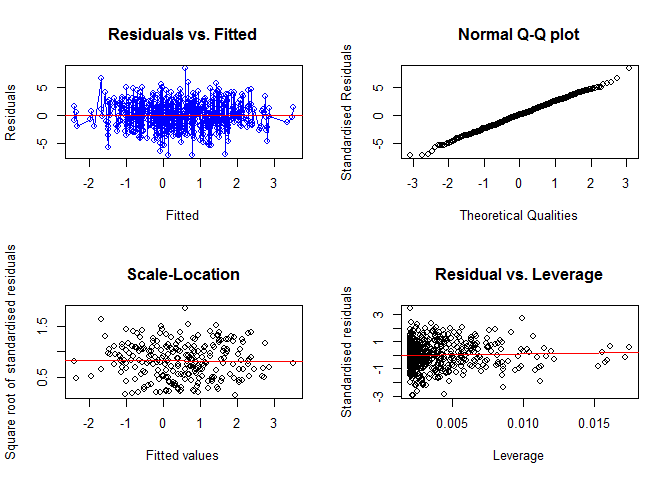

`blm` package description
=========================

### Lauren James

This package constructs a Bayesian Linear Model, which is a statistical linear regression approach that uses Bayesian inferences. It has a similar structure and appearance as the `lm` and `glm` interfaces. The Bayesian Linear Model takes on the structure y ~ x (+ other predictors) and provides a training set from which to predict response variables from real data.

This package was built as part of the course "Data Science: Software Development and Testing" during 2016-17 at the Bioinformatics Research Centre (BiRC) at Aarhus University, and is still under development using GitHub.

Using the `blm` package
-----------------------

### Installation

As this package is still under development, it can only be accessed and installed through github. In order to install a package through github, it requires the `devtools` package in R. Ensure that it is installed:

``` r
install.packages("devtools")
library(devtools)
```

Then install and load the package using the `install_github` feature:

``` r
install_github("laurenejames/blm")
library(blm)
```

### Features of the `blm` package

There are three built-in functions that aid in the set up for the constructor in the the main function `blm()` which are not so important, but will be listed here for information purposes:

`make_prior()`

This creates a prior distribution, with the following inputs `make_prior(model, alpha, mu = c(0,0))` where the model is a formula in the `blm` format mentioned above.

`model_matrix_responseless()`

Required to give the phiX matrix for the posterior distribution, with the following inputs `model_matrix_responseless(model, ...)` where the `...` indicates an optional data frame addition.

`update()`

Updates the prior distribution using observed data to generate a posterior distribution, with the following inputs `update(model, prior, beta, ...)`

**The main function: the `blm` constructor**

`blm()`

This produces the Bayesian Linear Modelm and the object for the functions mentioned below.

*Functions associated with `blm()`*

-   `coef()` Returns the coefficients of the blm(), mean and Sigma

-   `confint()` Returns a dataframe containing the mean, and confidence intervals (level set by an input to the function). Input parameters are as follows, `confint(object, parm, level, ...)` where the object is the blm, parm is the parameter(s) in question (default considers all parameters) and level sets the confidence interval (default is 95%).

-   `deviance()` Returns the deviance of the blm object when fitting a model and predicting the response variable based on the fitted blm.

-   `fitted()` Returns the fitted response variables from the blm

-   `plot()` Plots 4 similar graphs to the `lm` function, in a 2x2 grid. Residuals vs fitted, a Q-Q plot, a Scale-Location plot and a Residual vs. Leverage plot.

-   `predict()` Predicts response variables using a new data set from the fitted blm object. If there is no new data inputed into the function, it predicts based on the fitted response variable.

-   `print()` Prints the following features of the blm object:
-   Fitted blm
-   The fitted model's coefficients

-   `residuals()` Returns the residual values from the predicted response variable

-   `summary()` Returns the following features of the blm object:
-   Fitted blm
-   The fitted model's coefficients
-   The fitted model's residuals
-   The fitted model's deviance

### Example of using the `blm` package

``` r
# Create simulation data
alpha = 2; beta = 0.4
w0 = 0.5; w1 = 0.2; w2 = 1.2
simdata = data.frame(x = rnorm(500), z = rnorm(500))
simdata$y = rnorm(500, w0+w1*simdata$x+w2*simdata$z, 1/beta)
simmodel = y ~ x + z

# Construct the blm
my_new_blm = blm(simmodel, make_prior(simmodel, alpha, mu = c(0,0)), beta, simdata)

# Exploit all the functions
coef(my_new_blm)
```

    ## $mean
    ##                  [,1]
    ## (Intercept) 0.4792335
    ## x           0.1661331
    ## z           1.1084210
    ## 
    ## $Sigma
    ##               (Intercept)            x             z
    ## (Intercept)  4.990877e-03 0.0001168504 -4.550719e-05
    ## x            1.168504e-04 0.0047768083  1.989770e-04
    ## z           -4.550719e-05 0.0001989770  5.216909e-03

``` r
confint(my_new_blm)
```

    ##                  Mean     0.025     0.975
    ## (Intercept) 0.4792335 0.4694516 0.4890154
    ## x           0.1661331 0.1567707 0.1754955
    ## z           1.1084210 1.0981960 1.1186459

``` r
fitted(my_new_blm)
```

    ##     New Prediction    Sigma
    ## 1       0.12732856 2.508943
    ## 2       1.67718646 2.510933
    ## 3       1.22885254 2.511952
    ## 4      -2.39191620 2.547919
    ## 5       0.65867108 2.517984
    ## 6      -0.26048268 2.517398
    ## 7       1.62905384 2.512232
    ## 8       1.36191300 2.512503
    ## 9      -0.19555055 2.511563
    ## 10      2.64707501 2.527579
    ## 11      0.42016391 2.512107
    ## 12      0.38449779 2.507183
    ## 13      2.76249096 2.526707
    ## 14      1.75470234 2.513899
    ## 15     -1.17352621 2.519649
    ## 16     -0.57712155 2.518736
    ## 17      1.15415595 2.507086
    ## 18      2.37660888 2.523788
    ## 19      0.62507432 2.505939
    ## 20     -0.74700954 2.514651
    ## 21      1.56542248 2.510702
    ## 22      0.12133836 2.554499
    ## 23      0.06863747 2.510752
    ## 24      0.13655159 2.510759
    ## 25      2.26969154 2.521354
    ## 26      2.14405010 2.516619
    ## 27      0.01537987 2.506613
    ## 28     -0.58823428 2.510379
    ## 29      1.36686835 2.508259
    ## 30     -0.15003863 2.508559
    ## 31      1.12039782 2.531686
    ## 32      2.16421496 2.531705
    ## 33     -0.43278097 2.519149
    ## 34      1.38856077 2.512844
    ## 35      2.30654856 2.518880
    ## 36      0.15036964 2.508805
    ## 37      0.60151670 2.505162
    ## 38      3.34867661 2.555467
    ## 39      0.29620791 2.508707
    ## 40     -0.82662538 2.517726
    ## 41      1.50089963 2.518625
    ## 42      1.76775202 2.526665
    ## 43     -0.81258549 2.512582
    ## 44      0.29117949 2.510515
    ## 45      0.42069399 2.518635
    ## 46      1.25813453 2.507868
    ## 47      1.30436174 2.507815
    ## 48      1.69125850 2.515937
    ## 49      0.60374191 2.505416
    ## 50      0.07023875 2.505719
    ## 51      1.01726407 2.513103
    ## 52      0.48250449 2.506111
    ## 53      0.06621181 2.505845
    ## 54     -0.59190677 2.513803
    ## 55      1.27246466 2.512379
    ## 56     -0.05564654 2.507045
    ## 57     -0.07473427 2.516148
    ## 58     -0.15506515 2.513421
    ## 59      1.55656979 2.510313
    ## 60      2.41207508 2.526098
    ## 61      0.88552216 2.505675
    ## 62      1.28143003 2.508017
    ## 63     -0.38974680 2.512849
    ## 64      0.52443595 2.505197
    ## 65      0.70868930 2.507413
    ## 66     -0.76711354 2.523443
    ## 67      1.32157453 2.511525
    ## 68      1.36891596 2.509000
    ## 69      1.10841634 2.509656
    ## 70      0.95103799 2.507091
    ## 71     -0.01868494 2.508400
    ## 72     -0.99972224 2.515099
    ## 73     -0.65628292 2.510544
    ## 74      0.09450718 2.511932
    ## 75      0.43219965 2.505149
    ## 76     -0.06769681 2.506689
    ## 77      0.39370938 2.509107
    ## 78      0.35252856 2.527505
    ## 79     -0.82359047 2.512346
    ## 80     -1.49185310 2.522705
    ## 81      0.75662598 2.505462
    ## 82      0.74734904 2.513571
    ## 83      1.21826357 2.518819
    ## 84     -1.19995874 2.523573
    ## 85      2.01614148 2.515057
    ## 86      1.90585582 2.520692
    ## 87      1.56576421 2.510019
    ## 88      0.41875880 2.510082
    ## 89     -0.53808274 2.510604
    ## 90      2.19840931 2.517917
    ## 91     -0.06946861 2.508246
    ## 92      0.67612740 2.514377
    ## 93     -0.58665589 2.511501
    ## 94      0.20989219 2.505748
    ## 95      1.99679700 2.523959
    ## 96      1.13427955 2.508858
    ## 97      1.74871314 2.511670
    ## 98      0.34084313 2.505125
    ## 99      1.06554888 2.507347
    ## 100     0.73708675 2.508967
    ## 101     0.79965232 2.519751
    ## 102     2.79325426 2.528119
    ## 103     0.58541493 2.506379
    ## 104     0.23665309 2.522754
    ## 105     0.68470932 2.505153
    ## 106     0.35706948 2.507161
    ## 107    -1.48483760 2.527597
    ## 108     0.74438709 2.509391
    ## 109     1.21389800 2.507517
    ## 110     0.58007402 2.505769
    ## 111    -0.98823419 2.514140
    ## 112     3.51895352 2.552921
    ## 113     0.89987798 2.524073
    ## 114     1.71945190 2.511365
    ## 115     1.50165670 2.535723
    ## 116     0.01246836 2.522833
    ## 117     0.44758232 2.508784
    ## 118     1.73157904 2.513495
    ## 119     1.42478061 2.517244
    ## 120     2.10944107 2.518050
    ## 121     1.94671684 2.518239
    ## 122     0.83157289 2.505937
    ## 123    -1.12116427 2.515812
    ## 124     0.58504753 2.506643
    ## 125     2.72245910 2.536533
    ## 126    -0.16860573 2.521151
    ## 127    -0.31283879 2.508166
    ## 128    -0.59523664 2.510086
    ## 129    -0.66696063 2.511014
    ## 130    -0.12486018 2.506732
    ## 131     0.33501574 2.512873
    ## 132     1.91137425 2.529505
    ## 133     1.20279476 2.507189
    ## 134     0.93245733 2.532388
    ## 135    -0.61133553 2.510215
    ## 136     2.62336865 2.530133
    ## 137     1.84387695 2.514502
    ## 138    -0.85269694 2.515229
    ## 139     0.66681491 2.506557
    ## 140     2.69976824 2.556202
    ## 141     0.84947108 2.505576
    ## 142     0.39444276 2.506013
    ## 143     0.10719001 2.505728
    ## 144    -0.80085411 2.515929
    ## 145     0.99334051 2.521291
    ## 146     0.07988528 2.507411
    ## 147     1.63987314 2.513404
    ## 148     0.82964559 2.507814
    ## 149     1.32186299 2.510330
    ## 150     0.27161295 2.506736
    ## 151     0.07954805 2.506343
    ## 152     2.87435598 2.531954
    ## 153     0.29372169 2.505308
    ## 154     1.10924118 2.506916
    ## 155     1.42049971 2.512159
    ## 156     1.23271084 2.507367
    ## 157    -0.99106186 2.517327
    ## 158    -0.82713388 2.512952
    ## 159     0.49083688 2.505365
    ## 160     0.44014866 2.507369
    ## 161     0.07386042 2.505994
    ## 162    -0.29195839 2.509756
    ## 163     1.51218258 2.510108
    ## 164     1.60134545 2.513936
    ## 165     0.47811047 2.510649
    ## 166     0.16679455 2.511752
    ## 167    -0.55266148 2.515312
    ## 168    -2.41477610 2.540305
    ## 169     2.10316205 2.532116
    ## 170     0.40645785 2.514586
    ## 171    -1.48596065 2.533852
    ## 172     0.06752428 2.518468
    ## 173     0.60310108 2.505200
    ## 174    -0.93581862 2.518616
    ## 175     1.46259604 2.512275
    ## 176    -0.12671536 2.507183
    ## 177     0.99990750 2.508629
    ## 178     0.07271262 2.510730
    ## 179    -0.37036495 2.509261
    ## 180     0.47386395 2.505107
    ## 181     2.08889794 2.516935
    ## 182     2.81888304 2.528128
    ## 183    -0.87439398 2.519289
    ## 184     0.09865553 2.520648
    ## 185     1.24300605 2.526981
    ## 186     0.20823242 2.515284
    ## 187     0.40867499 2.509418
    ## 188     0.26825441 2.511603
    ## 189     0.78275910 2.510227
    ## 190     0.78521871 2.532402
    ## 191    -1.21181076 2.519166
    ## 192     0.08919793 2.505651
    ## 193    -0.42519254 2.509480
    ## 194     1.64117528 2.515774
    ## 195    -0.03203749 2.512040
    ## 196    -0.98401246 2.514217
    ## 197    -0.61956475 2.521072
    ## 198    -0.80207850 2.513942
    ## 199     2.85590951 2.534631
    ## 200    -1.68542999 2.527209
    ## 201    -0.98764342 2.519391
    ## 202    -0.79938967 2.512175
    ## 203     1.68904888 2.516500
    ## 204     2.25831546 2.519879
    ## 205    -0.71572015 2.512665
    ## 206     0.93380825 2.514482
    ## 207    -1.95030679 2.533489
    ## 208    -0.27402386 2.524479
    ## 209    -1.01540767 2.514555
    ## 210    -1.64120062 2.529601
    ## 211    -0.35391846 2.516942
    ## 212     0.26598343 2.508922
    ## 213     0.15287505 2.507260
    ## 214    -1.44104015 2.520666
    ## 215     2.77684844 2.527621
    ## 216     0.87708505 2.507581
    ## 217    -1.11964115 2.520170
    ## 218    -0.03503293 2.508002
    ## 219     0.79548560 2.510157
    ## 220    -0.64288226 2.511008
    ## 221     1.19447095 2.507556
    ## 222    -0.52296780 2.509787
    ## 223     1.20646695 2.508108
    ## 224     0.26479079 2.511115
    ## 225     1.13712146 2.507852
    ## 226    -1.31756916 2.518746
    ## 227     0.03079309 2.505880
    ## 228    -0.28989831 2.507811
    ## 229     1.06502082 2.506609
    ## 230     0.62801469 2.505230
    ## 231     2.07328734 2.521839
    ## 232     2.29326437 2.518792
    ## 233     1.31664138 2.513254
    ## 234     0.07172951 2.515721
    ## 235     0.26484697 2.512962
    ## 236     0.86821158 2.505683
    ## 237     1.22954693 2.509604
    ## 238    -1.26959784 2.519890
    ## 239     0.47581716 2.509846
    ## 240     2.17347577 2.516924
    ## 241    -0.55699516 2.545688
    ## 242     0.88133415 2.505920
    ## 243    -0.69622560 2.510962
    ## 244    -1.46136425 2.521198
    ## 245    -1.12988843 2.516164
    ## 246     0.39773954 2.512403
    ## 247     2.39193737 2.523157
    ## 248     0.06968478 2.511459
    ## 249    -0.23052465 2.507710
    ## 250     1.95552901 2.527753
    ## 251     1.42442446 2.512894
    ## 252     1.84802739 2.512784
    ## 253     0.08763175 2.507004
    ## 254     1.61779308 2.518217
    ## 255    -0.17239166 2.507546
    ## 256     1.13079219 2.506732
    ## 257     0.36352099 2.515915
    ## 258     0.24049039 2.512315
    ## 259    -2.32200216 2.539796
    ## 260     1.68296143 2.511819
    ## 261     2.29453491 2.520776
    ## 262    -0.54325148 2.511832
    ## 263    -0.92904081 2.530659
    ## 264    -0.03378385 2.507950
    ## 265    -0.35074168 2.509168
    ## 266     0.39118967 2.513775
    ## 267    -1.57310416 2.532800
    ## 268    -1.24115208 2.517670
    ## 269     1.63027976 2.510866
    ## 270    -0.21999890 2.507360
    ## 271     0.12282962 2.505549
    ## 272    -1.00938122 2.528851
    ## 273     0.87164802 2.508337
    ## 274     1.92000112 2.513880
    ## 275     1.22664945 2.511247
    ## 276     0.44709869 2.508138
    ## 277     0.34547203 2.505197
    ## 278     1.45584101 2.516953
    ## 279     1.85392057 2.512834
    ## 280     1.71768719 2.518517
    ## 281     1.57031591 2.521295
    ## 282     2.28719458 2.532968
    ## 283    -0.09826234 2.510858
    ## 284     0.97587738 2.508027
    ## 285     0.59934465 2.505409
    ## 286     1.59743478 2.510276
    ## 287    -0.07544811 2.507271
    ## 288     1.10315346 2.508749
    ## 289    -0.37271206 2.510863
    ## 290     1.22298741 2.507411
    ## 291    -1.11820373 2.516051
    ## 292     0.03744134 2.505980
    ## 293     0.17507020 2.506226
    ## 294     0.06540272 2.505841
    ## 295     0.40772843 2.507576
    ## 296     2.06110412 2.523036
    ## 297    -0.32305130 2.512311
    ## 298    -0.26566791 2.517272
    ## 299    -0.32919012 2.509525
    ## 300    -1.03539879 2.526117
    ## 301     1.57870104 2.525369
    ## 302     1.63576782 2.511176
    ## 303    -0.60418248 2.511133
    ## 304     1.32312010 2.508739
    ## 305     1.34746534 2.515045
    ## 306     1.52013110 2.513820
    ## 307    -0.91141593 2.531664
    ## 308     1.59055085 2.519554
    ## 309    -1.31088709 2.522709
    ## 310     0.41080921 2.506284
    ## 311    -0.05526127 2.506893
    ## 312    -0.75624523 2.511943
    ## 313     2.02622030 2.515882
    ## 314    -0.14936306 2.506682
    ## 315     2.33172964 2.520115
    ## 316     0.46144273 2.509403
    ## 317    -0.88403014 2.513990
    ## 318     2.41188483 2.520564
    ## 319     0.09785564 2.505667
    ## 320     0.74760592 2.514893
    ## 321     0.21349768 2.509702
    ## 322     1.26672529 2.507909
    ## 323     1.19819423 2.513649
    ## 324    -0.11038234 2.512593
    ## 325     0.80824860 2.506697
    ## 326     0.75853789 2.506183
    ## 327    -0.72702648 2.538005
    ## 328     2.33597072 2.519413
    ## 329     1.65325620 2.521357
    ## 330    -1.49630207 2.522744
    ## 331     0.65930941 2.516705
    ## 332     1.51775247 2.520059
    ## 333     0.31704453 2.506341
    ## 334     1.05245423 2.515655
    ## 335    -0.70191390 2.511050
    ## 336    -0.51240222 2.533644
    ## 337     1.08379498 2.509028
    ## 338     3.48995535 2.550479
    ## 339    -1.01733238 2.521773
    ## 340     0.34019711 2.505162
    ## 341    -0.07633574 2.507403
    ## 342    -0.27510730 2.513983
    ## 343    -1.67003805 2.532708
    ## 344    -0.13214679 2.509501
    ## 345     0.29121770 2.518466
    ## 346     1.33828607 2.520211
    ## 347     0.12544746 2.508690
    ## 348     0.90534497 2.517856
    ## 349     0.44624685 2.526625
    ## 350     2.66293163 2.545019
    ## 351     2.04053535 2.537962
    ## 352    -0.19777261 2.509062
    ## 353     0.40265162 2.506128
    ## 354     1.75208584 2.524403
    ## 355     0.59276581 2.505039
    ## 356     0.49163491 2.505024
    ## 357     0.58240183 2.505932
    ## 358     0.09102655 2.506580
    ## 359    -0.53449481 2.513970
    ## 360    -0.68080624 2.513804
    ## 361    -1.48081916 2.522841
    ## 362     0.40482375 2.511586
    ## 363    -0.51932836 2.519944
    ## 364     1.13325014 2.524170
    ## 365     0.59116477 2.508059
    ## 366     2.12209701 2.527624
    ## 367    -0.20597214 2.514963
    ## 368     1.54710728 2.539118
    ## 369     1.04296089 2.507613
    ## 370    -0.18797431 2.506890
    ## 371     0.61371191 2.507771
    ## 372     0.16985764 2.507739
    ## 373     0.68938702 2.510273
    ## 374     0.74869566 2.516866
    ## 375     0.82212190 2.505737
    ## 376     0.06320254 2.510936
    ## 377    -1.17271869 2.546902
    ## 378    -0.40154402 2.512081
    ## 379     0.16581176 2.527353
    ## 380     0.24007807 2.507736
    ## 381     1.13168681 2.507032
    ## 382     1.44082955 2.510501
    ## 383    -0.94569874 2.521625
    ## 384     0.01042816 2.506181
    ## 385     0.93737905 2.513295
    ## 386     0.39421930 2.517629
    ## 387    -0.26940189 2.507385
    ## 388     0.94717130 2.505949
    ## 389     0.27709424 2.507675
    ## 390     0.13979782 2.506732
    ## 391     0.77948283 2.505795
    ## 392    -0.40615482 2.519073
    ## 393    -1.54248642 2.527920
    ## 394     1.32310898 2.508519
    ## 395     1.47525405 2.517030
    ## 396     1.06785918 2.506688
    ## 397     1.60108097 2.510309
    ## 398     1.38516092 2.516970
    ## 399    -0.05593212 2.508958
    ## 400     1.40462324 2.510021
    ## 401     0.88641810 2.506102
    ## 402    -0.81377336 2.512305
    ## 403    -0.72496985 2.530913
    ## 404     1.46011434 2.524778
    ## 405    -1.86002086 2.536878
    ## 406    -1.42827598 2.520365
    ## 407     1.33263332 2.516981
    ## 408     0.37082071 2.525134
    ## 409    -0.63882826 2.515665
    ## 410     0.27972446 2.506562
    ## 411    -0.99721397 2.515919
    ## 412     1.80026121 2.514210
    ## 413    -0.60078535 2.514948
    ## 414     1.90080127 2.514243
    ## 415     0.82861442 2.506493
    ## 416     2.81107907 2.557565
    ## 417    -1.97121147 2.537797
    ## 418    -1.05997334 2.515614
    ## 419    -0.25442353 2.508300
    ## 420     0.14110858 2.508229
    ## 421    -0.01881951 2.508598
    ## 422     0.39066034 2.505904
    ## 423     0.73642433 2.515331
    ## 424     0.56984038 2.513864
    ## 425     1.04503646 2.508664
    ## 426     0.93792158 2.507746
    ## 427     1.17480179 2.508096
    ## 428     0.22693351 2.507660
    ## 429     0.77179708 2.508125
    ## 430     0.49436307 2.516670
    ## 431     1.15555762 2.508472
    ## 432    -0.13151725 2.507912
    ## 433    -0.75356973 2.539270
    ## 434     0.65568647 2.508699
    ## 435    -0.14931882 2.507404
    ## 436     1.00492472 2.506552
    ## 437     0.66486750 2.511893
    ## 438     1.64050298 2.510692
    ## 439    -0.09017175 2.510619
    ## 440     0.63660659 2.505345
    ## 441     0.84095763 2.511360
    ## 442    -1.30072488 2.533159
    ## 443    -0.66916461 2.512676
    ## 444    -0.01095078 2.506571
    ## 445     0.68378233 2.506378
    ## 446    -0.63193479 2.513469
    ## 447    -0.97680636 2.515080
    ## 448     0.57526458 2.508658
    ## 449     1.17271635 2.507777
    ## 450     1.28236524 2.512559
    ## 451    -0.15780669 2.517631
    ## 452    -0.49572562 2.519824
    ## 453    -1.16568980 2.517230
    ## 454    -1.21570706 2.517215
    ## 455     2.05575038 2.521254
    ## 456     0.86657308 2.505691
    ## 457     0.80916253 2.505437
    ## 458     2.14992248 2.517798
    ## 459    -0.16600192 2.512738
    ## 460    -1.49366764 2.521598
    ## 461     0.80993942 2.506033
    ## 462     1.35730742 2.516128
    ## 463     1.47329229 2.509314
    ## 464     0.20723396 2.505417
    ## 465    -2.35261546 2.549358
    ## 466     1.51523962 2.510407
    ## 467     0.68389036 2.527600
    ## 468     0.99940373 2.507008
    ## 469     1.10962736 2.506929
    ## 470     0.91569909 2.514199
    ## 471     2.37550455 2.526078
    ## 472     1.62904046 2.512409
    ## 473     0.11339881 2.507308
    ## 474    -0.29183681 2.510918
    ## 475     0.13426802 2.505934
    ## 476     1.45207156 2.510602
    ## 477     2.58355630 2.523675
    ## 478     0.37010943 2.505943
    ## 479     0.72548955 2.522269
    ## 480    -0.66757176 2.521095
    ## 481    -1.15659177 2.516293
    ## 482     2.44732168 2.521168
    ## 483     1.95157764 2.519771
    ## 484     0.81917205 2.519852
    ## 485     0.20555757 2.509270
    ## 486    -0.50156266 2.509165
    ## 487    -0.57748333 2.512881
    ## 488    -0.16513682 2.506764
    ## 489     1.89916523 2.513461
    ## 490    -0.16169915 2.518687
    ## 491     0.80324599 2.514720
    ## 492     1.25981315 2.512991
    ## 493    -1.13373345 2.516974
    ## 494    -0.56351505 2.532192
    ## 495     0.01070211 2.508768
    ## 496     1.81474462 2.512423
    ## 497     0.10889951 2.508954
    ## 498    -0.32146924 2.507918
    ## 499    -0.73767066 2.512438
    ## 500     0.42108798 2.519294

``` r
## Second data set for the predict function
simdata2 = data.frame(x = rnorm(500), z = rnorm(500))
simdata2$y = rnorm(500, w0+w1*simdata2$x+w2*simdata2$z, 1/beta)

# Carry on exploiting the functions
predict(my_new_blm, simdata2, beta)
```

    ##     New Prediction    Sigma
    ## 1       2.51689923 2.536985
    ## 2      -0.08214858 2.507469
    ## 3      -0.47420754 2.510119
    ## 4       2.96771432 2.522349
    ## 5       2.47074389 2.524399
    ## 6       0.61620773 2.506383
    ## 7       1.26972564 2.506393
    ## 8       1.01046320 2.506740
    ## 9       0.83102419 2.505783
    ## 10      0.52067657 2.507751
    ## 11     -1.47158204 2.521070
    ## 12     -1.80982433 2.526612
    ## 13     -0.52878007 2.519524
    ## 14     -1.18513065 2.551580
    ## 15      1.58348610 2.508424
    ## 16      0.80938072 2.505062
    ## 17      0.07240893 2.508460
    ## 18      0.17200104 2.506722
    ## 19      0.46020760 2.506925
    ## 20      1.79308362 2.511748
    ## 21      0.85808143 2.505151
    ## 22      2.03205991 2.512003
    ## 23      0.21894138 2.505758
    ## 24      0.77300906 2.505601
    ## 25      2.46312885 2.515588
    ## 26      2.48784130 2.526711
    ## 27      1.83321899 2.509472
    ## 28      0.47370912 2.505177
    ## 29      1.16989436 2.505767
    ## 30      0.71808989 2.505385
    ## 31      1.12685696 2.505716
    ## 32     -0.07991334 2.507460
    ## 33      0.13200984 2.508447
    ## 34      3.99289009 2.542178
    ## 35     -0.93632788 2.517924
    ## 36      1.05356116 2.507189
    ## 37      1.07839249 2.518669
    ## 38     -1.33134462 2.518741
    ## 39      0.87741479 2.518255
    ## 40      4.53022838 2.555837
    ## 41      2.37198930 2.525234
    ## 42      3.15346442 2.531749
    ## 43     -0.04505173 2.513694
    ## 44      1.49902768 2.508661
    ## 45      2.37656647 2.514837
    ## 46      1.03006234 2.511157
    ## 47      1.31662135 2.507418
    ## 48     -0.13070148 2.509020
    ## 49     -0.05895507 2.507048
    ## 50      0.66338689 2.525350
    ## 51     -0.07545534 2.507307
    ## 52      1.47327352 2.525431
    ## 53      1.16863245 2.507158
    ## 54     -0.66983489 2.511397
    ## 55      1.06938278 2.508068
    ## 56      0.36334376 2.505502
    ## 57      2.05839419 2.519197
    ## 58      1.32334890 2.515947
    ## 59      2.33168030 2.518094
    ## 60      0.08796789 2.507923
    ## 61      0.69379635 2.505192
    ## 62      1.84209017 2.516212
    ## 63     -1.26350781 2.524821
    ## 64      2.71078556 2.523640
    ## 65      1.42576085 2.515721
    ## 66     -0.10159438 2.507180
    ## 67      0.83933632 2.507175
    ## 68      0.59218130 2.522937
    ## 69      0.63623858 2.517688
    ## 70      0.41991751 2.516364
    ## 71     -0.40752336 2.512899
    ## 72      1.13341631 2.505883
    ## 73      0.78365572 2.507224
    ## 74      1.12073375 2.512809
    ## 75     -0.12326857 2.515325
    ## 76     -0.53232081 2.509994
    ## 77      0.87112221 2.506324
    ## 78      2.10491142 2.514289
    ## 79      1.12248123 2.506430
    ## 80      0.45216549 2.506656
    ## 81     -0.25112113 2.516368
    ## 82      0.51850152 2.515143
    ## 83     -0.13421519 2.507325
    ## 84      1.67108408 2.514527
    ## 85      0.84322648 2.533361
    ## 86     -0.50405681 2.513954
    ## 87     -1.11483487 2.523057
    ## 88      1.28255360 2.509023
    ## 89     -0.34852464 2.510130
    ## 90      1.55465130 2.513018
    ## 91     -0.34883134 2.508711
    ## 92     -0.06959298 2.510427
    ## 93      2.09932454 2.511672
    ## 94      1.85328074 2.515117
    ## 95     -0.91884108 2.513644
    ## 96      0.54907159 2.506453
    ## 97      0.96392453 2.506661
    ## 98     -0.63955780 2.533734
    ## 99      0.93449449 2.505992
    ## 100     1.21587908 2.509406
    ## 101    -0.38435780 2.510815
    ## 102    -1.65936246 2.528480
    ## 103    -0.86315070 2.515293
    ## 104    -0.19897519 2.508711
    ## 105     1.32830479 2.506383
    ## 106     1.36689803 2.519723
    ## 107    -0.23947090 2.507914
    ## 108    -0.13762972 2.536291
    ## 109    -1.30899505 2.518427
    ## 110     0.70132359 2.509931
    ## 111     2.57645466 2.524324
    ## 112    -2.29059662 2.534846
    ## 113    -0.25579355 2.515117
    ## 114     1.83690909 2.511232
    ## 115     1.37400480 2.512972
    ## 116    -1.01016097 2.515598
    ## 117     2.33924137 2.514150
    ## 118     1.76336401 2.510277
    ## 119     1.32450530 2.517967
    ## 120     1.38082434 2.506590
    ## 121     1.86778474 2.509630
    ## 122     1.27473375 2.510013
    ## 123     0.81094475 2.506998
    ## 124     1.22930088 2.506050
    ## 125    -1.09336664 2.519805
    ## 126     1.55377037 2.507681
    ## 127     1.22376363 2.506732
    ## 128     2.05639826 2.511801
    ## 129     0.84489278 2.508789
    ## 130    -0.12109121 2.510080
    ## 131     1.00013542 2.509983
    ## 132    -1.11529169 2.542719
    ## 133    -0.33567593 2.508625
    ## 134     1.89749158 2.519016
    ## 135     1.56714339 2.508492
    ## 136     2.60784992 2.519787
    ## 137     2.51129574 2.516228
    ## 138     1.96281867 2.511150
    ## 139    -2.28437848 2.534572
    ## 140     2.04710914 2.517148
    ## 141    -1.64931995 2.527750
    ## 142     0.99027694 2.505376
    ## 143     0.62315069 2.505756
    ## 144     0.94247294 2.510745
    ## 145     1.79776096 2.511028
    ## 146     0.61053859 2.512494
    ## 147     2.10714852 2.517353
    ## 148     3.32816859 2.548018
    ## 149     3.22873637 2.526594
    ## 150     0.40591525 2.509449
    ## 151    -2.35491118 2.538489
    ## 152     0.32458212 2.530960
    ## 153     0.76447349 2.505212
    ## 154     0.42540697 2.505966
    ## 155    -0.32563700 2.510563
    ## 156     0.73113309 2.505024
    ## 157    -0.41922621 2.517447
    ## 158     0.88400964 2.505253
    ## 159    -0.48941818 2.515729
    ## 160     0.11561660 2.509599
    ## 161     0.65164921 2.505139
    ## 162    -1.39442597 2.520443
    ## 163    -0.97295103 2.514342
    ## 164     1.43758420 2.523172
    ## 165     1.08617986 2.506645
    ## 166     1.59951873 2.512107
    ## 167     0.43059333 2.505264
    ## 168     1.70487509 2.511079
    ## 169     0.97067583 2.512848
    ## 170    -0.61102796 2.510671
    ## 171     0.86096913 2.508533
    ## 172     0.26386873 2.508659
    ## 173    -2.39194273 2.553811
    ## 174     2.69489827 2.528015
    ## 175    -1.42289024 2.523021
    ## 176    -0.23924108 2.508317
    ## 177     1.61337388 2.522104
    ## 178    -0.64425037 2.519685
    ## 179     1.96291717 2.522423
    ## 180     0.11926441 2.506275
    ## 181     0.13500059 2.512287
    ## 182     3.04729148 2.528651
    ## 183    -1.28932958 2.551945
    ## 184     1.10037754 2.510419
    ## 185     0.80915658 2.517262
    ## 186     0.25079950 2.505827
    ## 187     2.42307348 2.527130
    ## 188     2.03384989 2.512848
    ## 189     1.32413080 2.508061
    ## 190    -0.02609657 2.506824
    ## 191     2.62021208 2.521579
    ## 192    -1.80795850 2.526930
    ## 193     0.96409476 2.507129
    ## 194     0.75433975 2.506001
    ## 195    -0.06973544 2.511276
    ## 196    -0.47113895 2.511942
    ## 197     1.30597896 2.506748
    ## 198    -1.32987693 2.518624
    ## 199     0.10898511 2.510048
    ## 200     0.34729269 2.506473
    ## 201    -1.13529157 2.516582
    ## 202     0.65180881 2.506051
    ## 203     1.44687175 2.518323
    ## 204     1.94660707 2.520091
    ## 205     3.44058763 2.534878
    ## 206     0.04751093 2.516224
    ## 207     0.82312246 2.524294
    ## 208     1.76006721 2.514396
    ## 209    -0.21358881 2.509767
    ## 210     0.39167972 2.508032
    ## 211     1.94345314 2.575607
    ## 212    -0.34412806 2.509161
    ## 213     0.78010190 2.518836
    ## 214    -0.07844703 2.535735
    ## 215     0.29562155 2.507092
    ## 216     1.50860990 2.521699
    ## 217     1.04089887 2.506400
    ## 218    -0.59028507 2.511296
    ## 219     2.57665848 2.519655
    ## 220     0.67016246 2.505298
    ## 221     2.18745259 2.517617
    ## 222     1.62789918 2.511605
    ## 223     0.96036019 2.507047
    ## 224     1.52395074 2.508249
    ## 225    -0.66178323 2.517502
    ## 226    -0.36281044 2.513086
    ## 227     0.92437827 2.506545
    ## 228    -0.03478236 2.511593
    ## 229     0.69819987 2.519957
    ## 230    -0.87848167 2.520361
    ## 231     0.42268145 2.505944
    ## 232     4.19559772 2.549143
    ## 233    -0.60041650 2.510560
    ## 234    -2.12551544 2.536432
    ## 235     0.51022635 2.505112
    ## 236     2.33901648 2.514826
    ## 237     0.01176529 2.507152
    ## 238     1.57271164 2.508533
    ## 239     3.52150294 2.537201
    ## 240     2.13219676 2.517197
    ## 241     0.62571031 2.505638
    ## 242     2.69134620 2.518602
    ## 243     1.79352737 2.512798
    ## 244    -0.66895271 2.528561
    ## 245    -0.07748623 2.511814
    ## 246     0.35616662 2.505927
    ## 247     0.93313435 2.506937
    ## 248     2.43061356 2.515164
    ## 249    -0.53903895 2.514740
    ## 250     2.10953271 2.513716
    ## 251     1.38740572 2.514665
    ## 252     0.79498776 2.505041
    ## 253     0.48239808 2.505709
    ## 254     1.96251373 2.510401
    ## 255     0.11173217 2.506445
    ## 256    -1.25237335 2.579147
    ## 257     1.39594724 2.509494
    ## 258    -0.56549671 2.510823
    ## 259     2.04442694 2.534018
    ## 260    -0.05754915 2.507124
    ## 261     0.52615266 2.512393
    ## 262     0.34699793 2.505930
    ## 263    -0.63806120 2.516833
    ## 264     1.16436144 2.506860
    ## 265     2.79511425 2.525135
    ## 266    -0.02742525 2.513974
    ## 267     1.82194960 2.513100
    ## 268     0.12510580 2.509106
    ## 269     0.98750585 2.513299
    ## 270    -1.27506201 2.521570
    ## 271    -1.16337660 2.518900
    ## 272    -0.52024500 2.522803
    ## 273     0.95352799 2.505594
    ## 274    -0.38021325 2.518048
    ## 275     0.53123552 2.511994
    ## 276     2.09877141 2.512051
    ## 277    -0.25877642 2.516932
    ## 278     2.11802796 2.515571
    ## 279     1.30315401 2.510354
    ## 280     0.92217958 2.506615
    ## 281     1.43607488 2.509139
    ## 282     0.98941860 2.505331
    ## 283     1.93837710 2.515311
    ## 284     0.18515892 2.506310
    ## 285     1.02746698 2.505382
    ## 286     0.81974679 2.506924
    ## 287     0.69577762 2.530459
    ## 288    -0.12312963 2.507447
    ## 289     1.38873552 2.538585
    ## 290     2.03121742 2.514179
    ## 291     0.67591620 2.526660
    ## 292     2.66206115 2.517997
    ## 293     1.06173845 2.507380
    ## 294     3.10580093 2.537501
    ## 295    -2.19331516 2.538344
    ## 296     0.60037162 2.505894
    ## 297     0.69948287 2.506060
    ## 298     2.18886528 2.517879
    ## 299     0.55986784 2.506284
    ## 300     0.53946602 2.516557
    ## 301    -1.77257268 2.525320
    ## 302    -0.17828605 2.524168
    ## 303     0.26416525 2.506754
    ## 304     3.04435433 2.529853
    ## 305     0.73517705 2.505270
    ## 306    -1.41099472 2.520510
    ## 307     2.43878873 2.515322
    ## 308    -0.15445793 2.508308
    ## 309    -0.15067374 2.507385
    ## 310     3.01184410 2.524450
    ## 311     0.26949182 2.511633
    ## 312     2.85085185 2.526802
    ## 313     1.47647460 2.512519
    ## 314     1.18725215 2.517302
    ## 315     2.24550785 2.516005
    ## 316     1.58033906 2.507909
    ## 317     1.81275541 2.512319
    ## 318     0.97226497 2.517855
    ## 319     2.18281045 2.521201
    ## 320    -0.47883926 2.527867
    ## 321     1.78501195 2.544381
    ## 322    -1.27084284 2.528251
    ## 323     1.87595282 2.509734
    ## 324    -0.41555052 2.509466
    ## 325    -0.03170984 2.507839
    ## 326     0.74991306 2.505197
    ## 327     1.31170377 2.506291
    ## 328     2.82122169 2.520145
    ## 329     1.29356404 2.511044
    ## 330     1.41584126 2.507372
    ## 331    -1.58315296 2.523243
    ## 332     2.83126563 2.523982
    ## 333     0.61450265 2.505023
    ## 334     0.18301685 2.506821
    ## 335     0.13614905 2.506246
    ## 336     1.40106231 2.507121
    ## 337     1.61899602 2.508105
    ## 338    -0.06712596 2.507289
    ## 339     0.68762273 2.505922
    ## 340     0.17268827 2.510224
    ## 341    -1.19379951 2.516945
    ## 342     0.74524549 2.512822
    ## 343    -0.91735797 2.513716
    ## 344    -2.98913719 2.550251
    ## 345     0.73750269 2.506071
    ## 346    -0.38315990 2.528339
    ## 347     1.71581170 2.508573
    ## 348    -0.47508395 2.521943
    ## 349    -0.15344010 2.511807
    ## 350    -0.09646792 2.511050
    ## 351     1.14663644 2.507093
    ## 352     1.19849491 2.512927
    ## 353     1.33837840 2.512335
    ## 354     1.55997641 2.509281
    ## 355    -0.54608398 2.510351
    ## 356     1.73666808 2.510028
    ## 357    -0.10398263 2.515306
    ## 358     0.41995005 2.511024
    ## 359     2.31747531 2.513872
    ## 360     0.42836857 2.506478
    ## 361    -0.63790276 2.528707
    ## 362     0.89745031 2.508812
    ## 363     1.71200030 2.510102
    ## 364     0.87925963 2.511562
    ## 365    -0.19817679 2.517679
    ## 366    -0.18629829 2.522176
    ## 367     2.10871052 2.512570
    ## 368     1.09893645 2.508474
    ## 369     1.72874199 2.522523
    ## 370    -0.97480117 2.515195
    ## 371     1.21817482 2.519462
    ## 372     0.74136070 2.505754
    ## 373     0.08957701 2.517317
    ## 374     1.73454907 2.508939
    ## 375    -1.03784002 2.515426
    ## 376     2.28179722 2.518871
    ## 377    -2.47454250 2.538953
    ## 378    -0.11803585 2.507684
    ## 379     1.26393385 2.513781
    ## 380     0.29736176 2.511241
    ## 381     0.45282516 2.505982
    ## 382     1.45750560 2.512250
    ## 383     1.03542364 2.518686
    ## 384     2.72330245 2.541392
    ## 385     1.42983227 2.507907
    ## 386    -3.41984700 2.561394
    ## 387     1.45904989 2.507824
    ## 388     1.38511561 2.509220
    ## 389    -0.92181769 2.514602
    ## 390     1.37056867 2.508475
    ## 391    -0.25902893 2.513149
    ## 392     0.95187797 2.514295
    ## 393     1.35384251 2.506582
    ## 394     1.49646503 2.516571
    ## 395     0.72548253 2.510857
    ## 396     1.07236376 2.505487
    ## 397     1.95750911 2.510681
    ## 398     1.12767570 2.506183
    ## 399     0.41837345 2.505368
    ## 400    -0.08972972 2.508135
    ## 401     0.61529289 2.505383
    ## 402    -0.71219926 2.512333
    ## 403    -0.18148809 2.507819
    ## 404     1.48481018 2.511116
    ## 405    -0.98958351 2.515829
    ## 406    -0.04745957 2.509663
    ## 407    -0.15572544 2.512818
    ## 408    -2.44798515 2.547599
    ## 409     1.40678549 2.509860
    ## 410    -1.96553282 2.531975
    ## 411     1.19935055 2.505890
    ## 412    -0.25865620 2.508271
    ## 413     1.75177369 2.511569
    ## 414     1.02138972 2.507606
    ## 415     0.64740028 2.506233
    ## 416     0.43713580 2.543746
    ## 417     1.61564506 2.511728
    ## 418     0.90356871 2.506495
    ## 419     0.68657213 2.505673
    ## 420     1.97432313 2.518975
    ## 421    -0.76190146 2.514101
    ## 422     1.72376177 2.512014
    ## 423     1.19728648 2.513851
    ## 424     1.57994411 2.508536
    ## 425     1.65525941 2.523885
    ## 426    -0.93093880 2.537733
    ## 427     0.65879961 2.505337
    ## 428    -0.58912808 2.514113
    ## 429     0.92892923 2.505474
    ## 430     2.13359854 2.512081
    ## 431    -0.05842836 2.525446
    ## 432     0.92596291 2.517228
    ## 433    -0.17740053 2.507528
    ## 434     4.03077642 2.543305
    ## 435    -0.06321983 2.530981
    ## 436     1.40958923 2.526589
    ## 437     0.85788773 2.506399
    ## 438     1.32791938 2.546150
    ## 439     1.06959590 2.505784
    ## 440    -0.03743156 2.507543
    ## 441     0.49032924 2.517152
    ## 442     1.11950767 2.507703
    ## 443     1.93554879 2.510378
    ## 444     1.50744593 2.509603
    ## 445     0.56696612 2.505231
    ## 446     1.69759079 2.508666
    ## 447    -0.83113820 2.515994
    ## 448     0.19126746 2.506066
    ## 449    -0.33329700 2.515017
    ## 450     0.83129056 2.508021
    ## 451     1.15971535 2.514633
    ## 452     0.14196929 2.510284
    ## 453    -0.69560276 2.511414
    ## 454     1.41405027 2.507099
    ## 455     1.89399343 2.514179
    ## 456    -0.54608393 2.512521
    ## 457     1.33589906 2.506649
    ## 458     1.71055672 2.510745
    ## 459     1.02212099 2.505391
    ## 460    -0.79551085 2.542769
    ## 461     1.13121952 2.507857
    ## 462     0.95428160 2.510082
    ## 463    -0.18571457 2.522196
    ## 464    -1.42383611 2.520794
    ## 465     0.14831928 2.506166
    ## 466     0.92701977 2.508212
    ## 467     2.03342576 2.511945
    ## 468     1.27231955 2.506849
    ## 469     0.68222982 2.527471
    ## 470    -1.04276769 2.520676
    ## 471     1.93035304 2.510139
    ## 472     0.91976377 2.506382
    ## 473     0.88942417 2.505428
    ## 474    -0.68194884 2.517380
    ## 475    -0.60483719 2.517872
    ## 476    -0.10079494 2.514458
    ## 477    -0.12421653 2.510629
    ## 478     1.44920900 2.507906
    ## 479    -1.46123819 2.520792
    ## 480     2.09459634 2.517060
    ## 481    -0.74555130 2.511917
    ## 482     1.17166051 2.513339
    ## 483     2.46013922 2.517263
    ## 484    -0.94066387 2.513976
    ## 485    -0.04085742 2.512681
    ## 486    -1.60844779 2.523241
    ## 487     1.16018111 2.506709
    ## 488    -0.35283817 2.520501
    ## 489     0.04991195 2.507409
    ## 490     3.30301749 2.528283
    ## 491     1.41808034 2.512839
    ## 492    -0.69039003 2.516739
    ## 493     1.12224358 2.506346
    ## 494     1.90459633 2.510318
    ## 495     1.26869177 2.508742
    ## 496     1.18249309 2.506215
    ## 497    -0.44518540 2.509811
    ## 498    -0.89345153 2.513702
    ## 499    -0.60733313 2.510717
    ## 500     0.40346148 2.513232

``` r
residuals(my_new_blm)
```

    ##   [1] -7.18629811 -0.66311317 -0.10467861 -0.83996382  1.35432490
    ##   [6]  1.39698140 -1.49320212 -1.27705193 -2.44552379 -2.09379050
    ##  [11] -3.59027143  1.88385971  3.37536772 -1.87582903 -1.12502868
    ##  [16] -1.80023548 -0.02030094  4.61577705  2.13727468  2.90846891
    ##  [21] -0.16405509 -3.36496214 -3.25338433 -3.05755867 -2.15232639
    ##  [26]  3.79321969 -5.38178618  0.76628046 -0.63714339 -4.11491207
    ##  [31]  1.27809794 -0.49638877  1.45748828 -1.46404563  4.52088302
    ##  [36] -0.37562346 -2.45157953 -1.19968914  0.28638614  3.04717285
    ##  [41] -2.38664096 -4.67516702 -0.90485500 -3.17081455 -3.06669077
    ##  [46] -0.36756922 -5.48766696  3.77806496 -3.51666066  0.11085910
    ##  [51] -2.88744187 -4.81057333 -0.91712232 -0.38509622  2.29971819
    ##  [56]  5.47198059  1.52631824  0.68067426  1.76639421 -1.59725867
    ##  [61]  0.78498400  1.98803353  2.44809108 -0.19920578  0.75595532
    ##  [66]  0.48847191 -1.04167576  0.59564718 -1.11291160  1.11728136
    ##  [71]  5.07109027  5.08675565  1.65872511 -0.41345997 -1.58508603
    ##  [76] -5.02526465  3.60968828 -3.33312767 -0.61721949 -2.62401338
    ##  [81] -0.53373576  2.10497840 -1.13795321  2.09728871  2.16360537
    ##  [86] -1.28744811  0.42175605 -1.63548325  2.70076005 -0.31972188
    ##  [91] -1.97323375  3.12071806  2.69571550 -1.24641193 -0.67116837
    ##  [96] -0.29597451 -2.43196434 -2.31617856  1.91603464 -1.30573293
    ## [101] -0.33959209 -0.40670384  0.51612557  0.32143509 -0.06087100
    ## [106] -1.04950334  2.31598367  1.74702976 -4.19630499 -2.31136856
    ## [111]  0.41120864  1.47960016  1.02095485 -3.23033727  4.63558428
    ## [116]  1.98271263  4.67614648  2.66458593 -0.14651017  1.70631563
    ## [121]  0.04962368 -4.24198442  2.92428057  8.38675311  0.59194550
    ## [126] -3.66027963  2.10723057 -3.98059093  0.09049238  1.70268064
    ## [131]  0.35833317  0.52747187  0.17782694  4.28371909 -4.13651499
    ## [136] -2.35968120 -0.88879162 -1.79128802  2.13198451  1.10135776
    ## [141]  2.95655790 -0.17888685 -0.13236656 -2.89775703 -1.98630174
    ## [146] -0.05866924 -0.80396731 -3.01562339  0.60956875 -3.81629018
    ## [151]  0.12695827 -0.28707003 -1.32550573  2.51074441 -3.46136800
    ## [156] -5.38147391  1.44194543  0.07428361  3.80423256 -3.53593057
    ## [161] -3.73850712 -0.08579604  3.41247106 -0.97770592 -3.24120973
    ## [166]  0.41254311 -2.69504138  1.60252000 -1.95116457  2.53557089
    ## [171] -1.36852528  0.96891935 -1.88625474 -0.67090112  0.21514298
    ## [176] -1.93226511 -1.77071707  0.97587899  1.59680333  0.74178235
    ## [181]  2.65966462 -4.73005733  1.69325960  2.94040500 -2.37509298
    ## [186] -0.44137615 -3.64335560  0.36834923 -2.20383709 -7.13820400
    ## [191] -2.04084380 -2.31554225 -4.22446113  1.88318250 -5.41960505
    ## [196] -1.97861333 -2.13915280 -3.11157805  1.20082190  6.60100640
    ## [201]  2.54762133  2.02051318  2.30793066 -1.05110509 -0.34633995
    ## [206]  0.35582814  0.65554940  3.89892019 -1.29404610 -0.12380834
    ## [211] -1.91165857  2.37192738  0.11557013  2.15840284 -2.79061758
    ## [216] -0.73169054  3.24709096  1.84657484 -1.59976644  2.48925542
    ## [221] -0.11908437  0.16640784  0.40287802  0.90640450 -2.37248184
    ## [226]  1.39233942 -3.52627443 -0.09589420 -3.80416098 -0.51721504
    ## [231] -1.81972656  1.60770114  0.51907363 -0.61556976 -0.59004140
    ## [236]  0.93555590 -5.11757033 -1.80678772  0.13067000  1.01594259
    ## [241]  3.20165244  1.52822422  2.83587272  2.65945323  1.57387940
    ## [246]  0.15630852 -1.81333524  2.99232911 -4.43985379 -0.14558822
    ## [251]  0.96864687  4.13204492  4.42471878  2.44022324 -0.59511278
    ## [256]  1.55390898  2.80097496  2.70720858 -2.08417349 -7.01738818
    ## [261]  1.34806256 -2.84208645  2.27514777 -0.66584729 -1.68019444
    ## [266] -1.94103129  4.14432618 -2.98071447 -0.81273711  1.90696261
    ## [271] -1.60973850 -3.59137768  3.80937852  4.04621321 -5.22963062
    ## [276]  0.10519051  3.20189880  4.33772020 -0.60675204  2.46285910
    ## [281] -1.53990944 -0.98651050 -0.86003088  0.56122703 -0.09718540
    ## [286]  0.54399190 -6.53673314  2.88369602  1.97984753 -1.68329141
    ## [291]  1.19761212 -1.77195240 -2.42352895 -2.04313255  0.18307158
    ## [296]  0.44469883  2.47436655 -1.38756890  0.32313515  0.06528099
    ## [301]  3.64993801  2.82599995 -1.88584977 -0.79116481  4.10262807
    ## [306] -3.91707258 -3.11635291 -0.87841044  2.95656761  1.27047915
    ## [311]  2.60532927  1.16798150 -0.95406406 -0.09061308  0.62999116
    ## [316] -2.27103339 -1.93329880 -1.24093773  1.62201467  1.24975948
    ## [321] -2.80187731 -3.68933213 -1.24670371  0.52009004  3.96836232
    ## [326]  0.46789801  2.90448047  1.79534550 -2.91454400 -5.72581664
    ## [331]  1.64289649  3.63161249  0.28177517  1.04361588  4.52368445
    ## [336]  0.20363270 -4.89887879 -0.35431937 -2.89866801 -1.53383965
    ## [341]  0.10304739 -1.15279981  1.01197388 -1.51113325 -2.60037113
    ## [346]  3.13010389  3.26166946  2.03305522  2.46213051  0.62730175
    ## [351]  1.00989985  0.08578220  1.86330502  3.75449688 -1.84119818
    ## [356]  0.22567208  1.06647036  0.59676051  0.90287141  0.08958074
    ## [361] -3.65126295  1.40673673  2.75955438  3.02789202  2.88151889
    ## [366]  0.45111811 -0.15599675 -3.15149324  1.39277320 -3.66831554
    ## [371] -0.79072563  0.39550298  1.80956184 -3.00141874  0.12976309
    ## [376]  1.38757746  1.70119831  0.28912453 -0.76201381 -2.45324323
    ## [381] -1.87871444  5.70962792  3.30007453  0.66870581  1.31735551
    ## [386]  0.73559277  3.52433844  2.44991033 -2.44885160  0.59404723
    ## [391]  1.79844199 -0.99864459 -1.16868325 -1.36303748  0.16207165
    ## [396] -3.48284898 -0.47331678  2.92659920 -3.07991781 -0.28143624
    ## [401] -0.05179253  4.75172564 -2.98497693 -2.34061900 -2.02016241
    ## [406] -0.10920392  0.43382215 -0.33613074 -4.02218210 -1.78702899
    ## [411]  1.09710953  0.73476532 -0.29224146  1.38942950  2.51574851
    ## [416] -2.13563857 -0.73065976  1.67236772 -2.12624569  2.22806041
    ## [421] -2.11151760 -0.92729272  1.94930572  0.70984369  0.62210492
    ## [426]  0.09757632 -1.14765987  2.82491093  2.73210014 -2.91451791
    ## [431] -0.34793895  1.00222439 -3.12961845 -3.59344793 -0.37763964
    ## [436] -4.54882953 -0.31464137 -1.65377564  4.50998969 -1.34805558
    ## [441]  0.11170213  2.22662211 -0.61793094  0.69329726  0.72221582
    ## [446]  4.07160598 -1.21100368 -2.86026644  1.48592983  4.78139964
    ## [451]  3.00157154  0.86479498  2.04170970 -0.14122685  0.38053297
    ## [456] -1.55316779 -1.43054921  3.45784382  3.54162583 -2.03599453
    ## [461] -3.63406462 -1.23685721  4.28648042  1.23630247  0.55666122
    ## [466] -0.19056208  5.86954426  1.01172992  2.48501288  0.24089693
    ## [471]  1.92876526  1.45109918 -2.36601983  2.92001312  1.68558891
    ## [476] -0.69555002 -2.75861196 -1.53320793  1.26881015 -2.33504046
    ## [481] -0.94086925  1.05298789 -0.37419457  1.19776775  4.09235733
    ## [486] -0.63581278  1.56009471 -1.88200514  3.58905836  1.48935905
    ## [491]  1.29989070 -0.20651518  0.84790407  4.93387348 -1.50702014
    ## [496] -0.16298142 -2.71457901 -1.64907389 -2.33458791 -0.34427477

``` r
deviance(my_new_blm)
```

    ## [1] 3002.835

``` r
plot(my_new_blm)
```

    ## Warning in sqrt(st_res): NaNs produced



``` r
print(my_new_blm)
```

    ## [1] "Call:"
    ## blm(simmodel, make_prior(simmodel, alpha, mu = c(0, 0)), beta, 
    ##     simdata)
    ## 
    ## Coefficients
    ## 
    ## Mean:
    ##                  [,1]
    ## (Intercept) 0.4792335
    ## x           0.1661331
    ## z           1.1084210
    ## 
    ## Sigma:
    ##               (Intercept)            x             z
    ## (Intercept)  4.990877e-03 0.0001168504 -4.550719e-05
    ## x            1.168504e-04 0.0047768083  1.989770e-04
    ## z           -4.550719e-05 0.0001989770  5.216909e-03

``` r
summary(my_new_blm)
```

    ## [1] "Call:"
    ## blm(simmodel, make_prior(simmodel, alpha, mu = c(0, 0)), beta, 
    ##     simdata)
    ## 
    ## Coefficients
    ## 
    ## Mean:
    ##                  [,1]
    ## (Intercept) 0.4792335
    ## x           0.1661331
    ## z           1.1084210
    ## 
    ## Sigma:
    ##               (Intercept)            x             z
    ## (Intercept)  4.990877e-03 0.0001168504 -4.550719e-05
    ## x            1.168504e-04 0.0047768083  1.989770e-04
    ## z           -4.550719e-05 0.0001989770  5.216909e-03
    ## 
    ## Residuals:
    ##   [1] -7.18629811 -0.66311317 -0.10467861 -0.83996382  1.35432490
    ##   [6]  1.39698140 -1.49320212 -1.27705193 -2.44552379 -2.09379050
    ##  [11] -3.59027143  1.88385971  3.37536772 -1.87582903 -1.12502868
    ##  [16] -1.80023548 -0.02030094  4.61577705  2.13727468  2.90846891
    ##  [21] -0.16405509 -3.36496214 -3.25338433 -3.05755867 -2.15232639
    ##  [26]  3.79321969 -5.38178618  0.76628046 -0.63714339 -4.11491207
    ##  [31]  1.27809794 -0.49638877  1.45748828 -1.46404563  4.52088302
    ##  [36] -0.37562346 -2.45157953 -1.19968914  0.28638614  3.04717285
    ##  [41] -2.38664096 -4.67516702 -0.90485500 -3.17081455 -3.06669077
    ##  [46] -0.36756922 -5.48766696  3.77806496 -3.51666066  0.11085910
    ##  [51] -2.88744187 -4.81057333 -0.91712232 -0.38509622  2.29971819
    ##  [56]  5.47198059  1.52631824  0.68067426  1.76639421 -1.59725867
    ##  [61]  0.78498400  1.98803353  2.44809108 -0.19920578  0.75595532
    ##  [66]  0.48847191 -1.04167576  0.59564718 -1.11291160  1.11728136
    ##  [71]  5.07109027  5.08675565  1.65872511 -0.41345997 -1.58508603
    ##  [76] -5.02526465  3.60968828 -3.33312767 -0.61721949 -2.62401338
    ##  [81] -0.53373576  2.10497840 -1.13795321  2.09728871  2.16360537
    ##  [86] -1.28744811  0.42175605 -1.63548325  2.70076005 -0.31972188
    ##  [91] -1.97323375  3.12071806  2.69571550 -1.24641193 -0.67116837
    ##  [96] -0.29597451 -2.43196434 -2.31617856  1.91603464 -1.30573293
    ## [101] -0.33959209 -0.40670384  0.51612557  0.32143509 -0.06087100
    ## [106] -1.04950334  2.31598367  1.74702976 -4.19630499 -2.31136856
    ## [111]  0.41120864  1.47960016  1.02095485 -3.23033727  4.63558428
    ## [116]  1.98271263  4.67614648  2.66458593 -0.14651017  1.70631563
    ## [121]  0.04962368 -4.24198442  2.92428057  8.38675311  0.59194550
    ## [126] -3.66027963  2.10723057 -3.98059093  0.09049238  1.70268064
    ## [131]  0.35833317  0.52747187  0.17782694  4.28371909 -4.13651499
    ## [136] -2.35968120 -0.88879162 -1.79128802  2.13198451  1.10135776
    ## [141]  2.95655790 -0.17888685 -0.13236656 -2.89775703 -1.98630174
    ## [146] -0.05866924 -0.80396731 -3.01562339  0.60956875 -3.81629018
    ## [151]  0.12695827 -0.28707003 -1.32550573  2.51074441 -3.46136800
    ## [156] -5.38147391  1.44194543  0.07428361  3.80423256 -3.53593057
    ## [161] -3.73850712 -0.08579604  3.41247106 -0.97770592 -3.24120973
    ## [166]  0.41254311 -2.69504138  1.60252000 -1.95116457  2.53557089
    ## [171] -1.36852528  0.96891935 -1.88625474 -0.67090112  0.21514298
    ## [176] -1.93226511 -1.77071707  0.97587899  1.59680333  0.74178235
    ## [181]  2.65966462 -4.73005733  1.69325960  2.94040500 -2.37509298
    ## [186] -0.44137615 -3.64335560  0.36834923 -2.20383709 -7.13820400
    ## [191] -2.04084380 -2.31554225 -4.22446113  1.88318250 -5.41960505
    ## [196] -1.97861333 -2.13915280 -3.11157805  1.20082190  6.60100640
    ## [201]  2.54762133  2.02051318  2.30793066 -1.05110509 -0.34633995
    ## [206]  0.35582814  0.65554940  3.89892019 -1.29404610 -0.12380834
    ## [211] -1.91165857  2.37192738  0.11557013  2.15840284 -2.79061758
    ## [216] -0.73169054  3.24709096  1.84657484 -1.59976644  2.48925542
    ## [221] -0.11908437  0.16640784  0.40287802  0.90640450 -2.37248184
    ## [226]  1.39233942 -3.52627443 -0.09589420 -3.80416098 -0.51721504
    ## [231] -1.81972656  1.60770114  0.51907363 -0.61556976 -0.59004140
    ## [236]  0.93555590 -5.11757033 -1.80678772  0.13067000  1.01594259
    ## [241]  3.20165244  1.52822422  2.83587272  2.65945323  1.57387940
    ## [246]  0.15630852 -1.81333524  2.99232911 -4.43985379 -0.14558822
    ## [251]  0.96864687  4.13204492  4.42471878  2.44022324 -0.59511278
    ## [256]  1.55390898  2.80097496  2.70720858 -2.08417349 -7.01738818
    ## [261]  1.34806256 -2.84208645  2.27514777 -0.66584729 -1.68019444
    ## [266] -1.94103129  4.14432618 -2.98071447 -0.81273711  1.90696261
    ## [271] -1.60973850 -3.59137768  3.80937852  4.04621321 -5.22963062
    ## [276]  0.10519051  3.20189880  4.33772020 -0.60675204  2.46285910
    ## [281] -1.53990944 -0.98651050 -0.86003088  0.56122703 -0.09718540
    ## [286]  0.54399190 -6.53673314  2.88369602  1.97984753 -1.68329141
    ## [291]  1.19761212 -1.77195240 -2.42352895 -2.04313255  0.18307158
    ## [296]  0.44469883  2.47436655 -1.38756890  0.32313515  0.06528099
    ## [301]  3.64993801  2.82599995 -1.88584977 -0.79116481  4.10262807
    ## [306] -3.91707258 -3.11635291 -0.87841044  2.95656761  1.27047915
    ## [311]  2.60532927  1.16798150 -0.95406406 -0.09061308  0.62999116
    ## [316] -2.27103339 -1.93329880 -1.24093773  1.62201467  1.24975948
    ## [321] -2.80187731 -3.68933213 -1.24670371  0.52009004  3.96836232
    ## [326]  0.46789801  2.90448047  1.79534550 -2.91454400 -5.72581664
    ## [331]  1.64289649  3.63161249  0.28177517  1.04361588  4.52368445
    ## [336]  0.20363270 -4.89887879 -0.35431937 -2.89866801 -1.53383965
    ## [341]  0.10304739 -1.15279981  1.01197388 -1.51113325 -2.60037113
    ## [346]  3.13010389  3.26166946  2.03305522  2.46213051  0.62730175
    ## [351]  1.00989985  0.08578220  1.86330502  3.75449688 -1.84119818
    ## [356]  0.22567208  1.06647036  0.59676051  0.90287141  0.08958074
    ## [361] -3.65126295  1.40673673  2.75955438  3.02789202  2.88151889
    ## [366]  0.45111811 -0.15599675 -3.15149324  1.39277320 -3.66831554
    ## [371] -0.79072563  0.39550298  1.80956184 -3.00141874  0.12976309
    ## [376]  1.38757746  1.70119831  0.28912453 -0.76201381 -2.45324323
    ## [381] -1.87871444  5.70962792  3.30007453  0.66870581  1.31735551
    ## [386]  0.73559277  3.52433844  2.44991033 -2.44885160  0.59404723
    ## [391]  1.79844199 -0.99864459 -1.16868325 -1.36303748  0.16207165
    ## [396] -3.48284898 -0.47331678  2.92659920 -3.07991781 -0.28143624
    ## [401] -0.05179253  4.75172564 -2.98497693 -2.34061900 -2.02016241
    ## [406] -0.10920392  0.43382215 -0.33613074 -4.02218210 -1.78702899
    ## [411]  1.09710953  0.73476532 -0.29224146  1.38942950  2.51574851
    ## [416] -2.13563857 -0.73065976  1.67236772 -2.12624569  2.22806041
    ## [421] -2.11151760 -0.92729272  1.94930572  0.70984369  0.62210492
    ## [426]  0.09757632 -1.14765987  2.82491093  2.73210014 -2.91451791
    ## [431] -0.34793895  1.00222439 -3.12961845 -3.59344793 -0.37763964
    ## [436] -4.54882953 -0.31464137 -1.65377564  4.50998969 -1.34805558
    ## [441]  0.11170213  2.22662211 -0.61793094  0.69329726  0.72221582
    ## [446]  4.07160598 -1.21100368 -2.86026644  1.48592983  4.78139964
    ## [451]  3.00157154  0.86479498  2.04170970 -0.14122685  0.38053297
    ## [456] -1.55316779 -1.43054921  3.45784382  3.54162583 -2.03599453
    ## [461] -3.63406462 -1.23685721  4.28648042  1.23630247  0.55666122
    ## [466] -0.19056208  5.86954426  1.01172992  2.48501288  0.24089693
    ## [471]  1.92876526  1.45109918 -2.36601983  2.92001312  1.68558891
    ## [476] -0.69555002 -2.75861196 -1.53320793  1.26881015 -2.33504046
    ## [481] -0.94086925  1.05298789 -0.37419457  1.19776775  4.09235733
    ## [486] -0.63581278  1.56009471 -1.88200514  3.58905836  1.48935905
    ## [491]  1.29989070 -0.20651518  0.84790407  4.93387348 -1.50702014
    ## [496] -0.16298142 -2.71457901 -1.64907389 -2.33458791 -0.34427477
    ## 
    ## Deviance:
    ## [1] 3002.835

Reference
---------

Mailund, T. "Introduction to Data Science and Statistical Programming in R"
